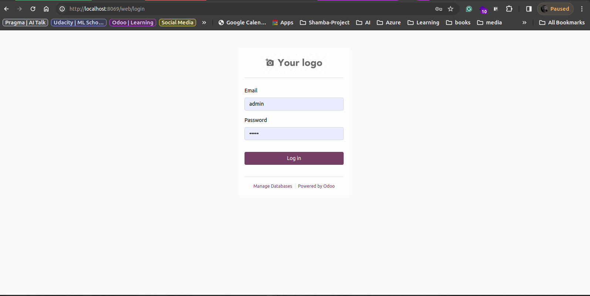

# Learning Odoo 17.
A quick project to learn Odoo 17.

> **Note :**
> - I will rely on [the official documentation of Odoo 17](https://www.odoo.com/documentation/17.0/developer/tutorials/) for this mini-project and then summarize what I have learned.
>
> - I will use [ChatGPT](https://chat.openai.com/) to provide a summary with a simple storytelling technique, making this document accessible and easy to understand even for novices.

## Chap 1 : Architecture Overview

In the world of software, there exists a system known as Odoo, which follows a multitier structure. It resembles a grand castle with three distinct layers: the presentation tier, the logic tier, and the data tier. 🏰


In this castle, the presentation tier is like the castle's exterior, made of HTML5, JavaScript, and CSS. It's what visitors see and interact with. The logic tier, however, is like the castle's intricate machinery, all written in Python. This layer handles the castle's inner workings, ensuring everything runs smoothly. Lastly, the data tier, akin to the castle's vault, stores all the important information using PostgreSQL as its guardian. 🛡️

Now, within this castle, developers roam freely, crafting extensions called modules. Each module is like a special chamber dedicated to a specific purpose. Some modules add new features to the castle, while others extend existing functionalities. Imagine one module adding magical accounting rules to manage the kingdom's finances, while another conjures up real-time visualizations of flying dragons. 🐉

To understand these modules, one has to learn the castle's language. A module can contain various elements like business objects, object views, data files, web controllers, and even static web data like images and scripts. Each element serves a unique purpose, contributing to the castle's grandeur. 🌟

Imagine a brave adventurer embarking on a journey to create their own module. They venture into the module's directory, organized neatly like rooms in a castle. Inside, they find business objects, declared as Python classes, object views defining how information is displayed, and data files, either XML or CSV, holding vital information for the castle's operation. 🛠️

But wait, there are different versions of this castle! Odoo comes in two flavors: Enterprise and Community. The Enterprise version, with its licensed access, offers extra features, like secret chambers hidden within the castle walls. However, from a technical standpoint, these extra features are just additional modules layered atop the Community version. 🔒

Now, our adventurer is ready to embark on their journey. But before diving into writing code, they decide to prepare by reviewing the castle's installation process. After all, even seasoned knights need to ensure they start their quests on the right foot. 🚀

And thus, armed with knowledge and determination, our adventurer sets forth to conquer the realm of Odoo, one module at a time. 🌌

## Chapter 2: Development Environment Configuration


### Note:
> `./addons` : This directory contains all the modules we want to add to Odoo 17. Therefore, it includes the module we are going to develop.

> This directory will be part of the addon paths that reference all directories containing Odoo modules.
> 
> 
> `./config/odoo.conf` : This file contains Odoo configurations.
>
> `docker-compose.yml` : This file contains deployment configurations for deploying Odoo on localhost.

🌐 In the world of Odoo, where developers shape the digital corridors of the software, setting up the development environment is a key step. Like a chef preparing their favorite recipe, each developer has their own method, but for Odoo insiders, there's a preferred path: installation from the source code.

It all starts with environment preparation. Just like preparing ingredients to concoct a delightful dish, following the steps of the contribution guide is essential. Once these steps are followed, you have two precious ingredients: the local repositories [odoo/odoo](https://github.com/odoo/odoo) and [odoo/enterprise](https://github.com/odoo/enterprise).

For easier installation, it's better to use the [containerized version of Odoo](https://hub.docker.com/_/odoo/) and then orchestrate with Docker. Take a look at the `./docker-compose.yml` file.

To complete the preparation, you need to copy this project to your personal GitHub account. Click `"Fork"` to create a copy of this repository in your account.

Then, using the command below, replace `<your_github_account>` with the name of your GitHub account to download your copy of this project to your machine:

```bash
git clone git@github.com:<votre_compte_github>/learning-odoo-17.git
```

And there you go! Your environment is ready to run Odoo on your local machine. And here's how to launch Odoo 17 on your machine:

```bash
cd learning-odoo-17
docker compose up -d
```
To check the installation, simply open your browser and type [http://localhost:8069/web](http://localhost:8069/web).

```yaml
username : admin
password : admin
```



To view the `logs` data of the `odoo` container:

```bash
docker logs -f odoo17Learning
docker logs -f postgres_odoo17Learning
```


To view the `logs` data the `postgres` container:

```bash
docker logs -f postgres_odoo17Learning
```


Now that your server is running, it's time to write our own application! 😎