# Learning Odoo 17.
A quick project to learn Odoo 17.

> **Note :**
> - I will rely on [the official documentation of Odoo 17](https://www.odoo.com/documentation/17.0/developer/tutorials/) for this mini-project and then summarize what I have learned.
>
> - I will use [ChatGPT](https://chat.openai.com/) to provide a summary with a simple storytelling technique, making this document accessible and easy to understand even for novices.

## Chap 1 : Architecture Overview

In the world of software, there exists a system known as Odoo, which follows a multitier structure. It resembles a grand castle with three distinct layers: the presentation tier, the logic tier, and the data tier. 🏰


In this castle, the presentation tier is like the castle's exterior, made of HTML5, JavaScript, and CSS. It's what visitors see and interact with. The logic tier, however, is like the castle's intricate machinery, all written in Python. This layer handles the castle's inner workings, ensuring everything runs smoothly. Lastly, the data tier, akin to the castle's vault, stores all the important information using PostgreSQL as its guardian. 🛡️

Now, within this castle, developers roam freely, crafting extensions called modules. Each module is like a special chamber dedicated to a specific purpose. Some modules add new features to the castle, while others extend existing functionalities. Imagine one module adding magical accounting rules to manage the kingdom's finances, while another conjures up real-time visualizations of flying dragons. 🐉

To understand these modules, one has to learn the castle's language. A module can contain various elements like business objects, object views, data files, web controllers, and even static web data like images and scripts. Each element serves a unique purpose, contributing to the castle's grandeur. 🌟

Imagine a brave adventurer embarking on a journey to create their own module. They venture into the module's directory, organized neatly like rooms in a castle. Inside, they find business objects, declared as Python classes, object views defining how information is displayed, and data files, either XML or CSV, holding vital information for the castle's operation. 🛠️

But wait, there are different versions of this castle! Odoo comes in two flavors: Enterprise and Community. The Enterprise version, with its licensed access, offers extra features, like secret chambers hidden within the castle walls. However, from a technical standpoint, these extra features are just additional modules layered atop the Community version. 🔒

Now, our adventurer is ready to embark on their journey. But before diving into writing code, they decide to prepare by reviewing the castle's installation process. After all, even seasoned knights need to ensure they start their quests on the right foot. 🚀

And thus, armed with knowledge and determination, our adventurer sets forth to conquer the realm of Odoo, one module at a time. 🌌

## [SETUP GUIDE] Development Environment Configuration


### Note:
> `./addons` : This directory contains all the modules we want to add to Odoo 17. Therefore, it includes the module we are going to develop.

> This directory will be part of the addon paths that reference all directories containing Odoo modules.
> 
> 
> `./config/odoo.conf` : This file contains Odoo configurations.
>
> `docker-compose.yml` : This file contains deployment configurations for deploying Odoo on localhost.

🌐 In the world of Odoo, where developers shape the digital corridors of the software, setting up the development environment is a key step. Like a chef preparing their favorite recipe, each developer has their own method, but for Odoo insiders, there's a preferred path: installation from the source code.

It all starts with environment preparation. Just like preparing ingredients to concoct a delightful dish, following the steps of the contribution guide is essential. Once these steps are followed, you have two precious ingredients: the local repositories [odoo/odoo](https://github.com/odoo/odoo) and [odoo/enterprise](https://github.com/odoo/enterprise).

For easier installation, it's better to use the [containerized version of Odoo](https://hub.docker.com/_/odoo/) and then orchestrate with Docker. Take a look at the `./docker-compose.yml` file.

To complete the preparation, you need to copy this project to your personal GitHub account. Click `"Fork"` to create a copy of this repository in your account.

Then, using the command below, replace `<your_github_account>` with the name of your GitHub account to download your copy of this project to your machine:

```bash
git clone git@github.com:<votre_compte_github>/learning-odoo-17.git
```

And there you go! Your environment is ready to run Odoo on your local machine. And here's how to launch Odoo 17 on your machine:

```bash
cd learning-odoo-17
docker compose up -d
```
To check the installation, simply open your browser and type [http://localhost:8069/web](http://localhost:8069/web).

```yaml
username : admin
password : admin
```


To view the `logs` data of the `odoo` container:

```bash
docker logs -f odoo17Learning
docker logs -f postgres_odoo17Learning
```

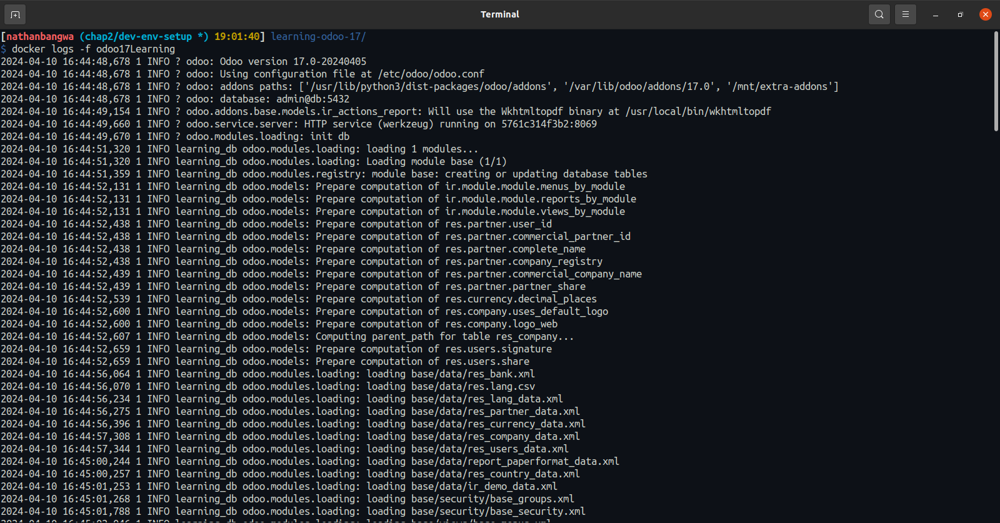

To view the `logs` data the `postgres` container:

```bash
docker logs -f postgres_odoo17Learning
```
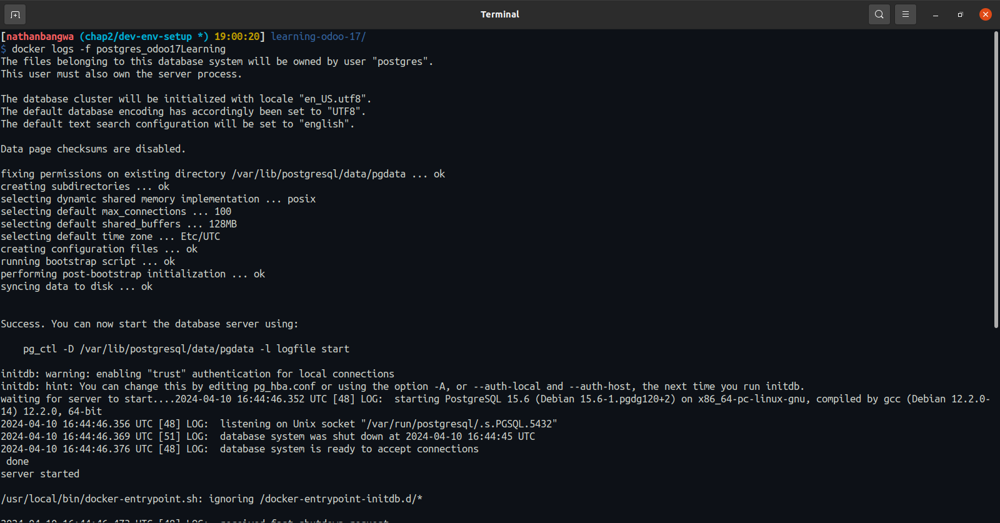

Now that your server is running, it's time to write our own application! 😎

---

## Chapter 2 : A New Application.

📖 The purpose of this chapter is to embark on a journey of creation, laying the very foundation for a brand new `Odoo module`. Imagine starting from scratch, with only the bare essentials needed to catch Odoo's attention. As we progress through the chapters, we'll add layers of features, weaving a tapestry of a realistic business case.

🏠 Welcome to the realm of the `Real Estate` Advertisement module. This module delves into a specialized business area not commonly found in the standard set of Odoo modules: `real estate`. But before diving headfirst into development, it's wise to scout Odoo's vast kingdom to ensure no existing solutions already address our specific needs.

🔍 Picture a main `list view` adorned with various advertisements, each telling a story of properties waiting to be discovered. The form view reveals essential details about each property: from the number of bedrooms to the presence of a garden, offering a glimpse into the world within.


💼 The second tab unveils a treasure trove of `offers`, where potential `buyers` can make `bids` above or below the expected `selling price`. It's a realm where `negotiations` unfold, leaving the final decision in the hands of the `seller`.


🎥 And as if by magic, a quick video showcases the graceful dance of the module's workflow. Ah, if only it were captured already!

🛠 But fret not, for our journey begins with a humble task: preparing the `addon directory`. This step ensures that Odoo recognizes our newborn module, even if it's but an empty vessel for now. Soon, it will proudly stand among the `Apps`, awaiting its chance to shine.

✨ With a flick of a wand (or perhaps a few keyboard strokes), we create the necessary files: `__init__.py` and `__manifest__.py`. These files breathe life into our module, defining its `name` and `dependencies`, much like a spellbook detailing the ingredients of a potent potion.

🧙‍♂️ `Restart` the Odoo server, `update` the Apps list, and behold! Our module, like a budding flower, blooms into view. But wait, did it not appear? Fear not, for a simple tweak, removing the `default filter`, reveals our creation in all its glory.


🔑 And now, with a final flourish, `we make our module an 'App'`, ensuring its presence even when the `Apps filter` is on. Though it may be but an empty shell, devoid of menus, it's a promising start to our magical journey.

📜 With the groundwork laid, our adventure continues as we prepare to `create our first model`. Exciting times lie ahead as we breathe life into our module, one enchanting step at a time.

---

## Chapter 3 : Models And Basic Fields

🏰 Picture our `Odoo module` as a freshly built house - sturdy and promising, yet lacking the warmth of life within its walls. In this chapter, our quest was to breathe life into our module by giving it the ability to `store data`. 💼

As we delved deeper into the documentation, we discovered [Object-Relational Mapping (ORM)](https://www.prisma.io/dataguide/types/relational/what-is-an-orm), a wondrous tool bridging the gap between our Python code and the `database`. ✨ This powerful technique allows us to define our `business objects as Python classes`, extending the `Model` class. With a simple invocation, our model came to life, seamlessly integrating into Odoo's automated persistence system.

Our task was to create the `real estate properties model`. Inspired by the example given in the `CRM module`, we embarked on our quest, shaping the necessary files and folders to define our `model`. 🏡 With each keystroke, the framework began to take shape, and soon, our model stood proudly, ready to capture the essence of `real estate properties`.

But our journey did not end there. We set out to infuse our model with `basic fields`, such as `name`, `description`, and `price`. Like an artisan adding details to a work of art, we enriched our model with `fields` of different `types` - `Char`, `Text`, `Integer`, and even `Boolean`. Each field brought a new dimension to our `model`, enriching it with the essence of real-world data. 🎨

💡 Here's how to connect to the database inside the container to view the data.

```bash
docker exec -it postgres_odoo17Learning psql -U admin -d learning_db

SELECT COUNT(*) FROM estate_property;

\d estate_property;
```

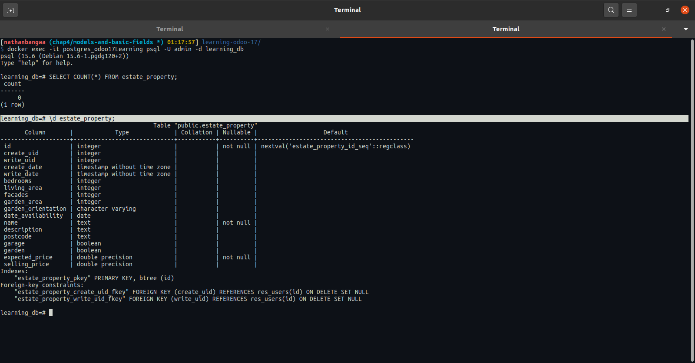

Yet, our work was not complete until we ensured the `integrity` of our `data`. With a flourish of our craftsmanship, we defined `attributes` for our `fields`, making them `required` and ensuring their presence in every `record`. We even explored the realm of `Automatic Fields`, uncovering the hidden mechanism behind fields like `id`, `create_date`, and `write_user`. 🔮

And so, our journey through Chapter 4 came to an end, but our module was now imbued with the power to `store and manage` real estate `data`. With each step forward, our `module` grew stronger, paving the way for greater adventures in the realm of `Odoo`. 🚀

---

## Chapter 4: Security - A Brief Introduction

In the journey of building our `Odoo module`, we've ventured into the realm of `security`, a crucial aspect in any software application, especially when it comes to managing `sensitive` business `data`. 🏰

Imagine our `module` as a fortified castle, safeguarding valuable `information` about properties and transactions within its walls. But who gets `access` to enter this castle? This is where `Odoo's security mechanism` comes into play, like the gatekeeper controlling entry to the castle. 🛡️

We've learned that `Odoo` relies heavily on data, and one way to populate our `module` with essential information is through `CSV files`. These files act as the blueprint, defining the structure and content of our data. For instance, we've seen how a `CSV file` sets up the states of countries, laying the foundation for our data castle. 📋

However, `loading data` is just one part of the `security` equation. We also need to `control` who can `view`, `edit`, `create`, or `delete` this data. This is where `access rights` come in. Access rights act as the guards patrolling the castle walls, ensuring only `authorized users` can access specific areas. 🚨

To implement `access rights`, we create `rules` that dictate what each `user` or `group` of users can do within our `module`. These `rules` are defined in `CSV files`, just like our data files, and are loaded into Odoo's security system.

In our journey, we've set out to `grant access rights` to the `base.group_user`, essentially allowing them to roam freely within our module, albeit within certain limits. 🔒


With `access rights` in place, our module's `security` is fortified, and we're now ready to open the gates and let users interact with our `module's user interface`, marking the next phase of our adventure in Odoo development. 🚀

---

## Chapter 5: Finally, Some UI To Play With

Now that we've laid the foundation with our new `model` and access rights, it's time to dive into the exciting world of `user interface` interaction. 🚀

### Data Files (XML)

In our journey to understand `Odoo`, we've encountered various ways to handle `data`. While `CSV files` are great for simple data, the `XML format` steps in for more `complex structures` like `views` or email templates. These `XML files`, residing in the same folders as `CSVs`, define the intricate `UI elements` we interact with. 📝


### Actions and Menus

`Actions` are the `bridge` between `menus` and `models`, defining what happens when we `click` or interact with `elements` in the interface. In our `real estate` scenario, actions empower us to navigate through lists and `forms` seamlessly. ⚙️


`Menus` in Odoo follow a `hierarchical structure`, guiding us through different `levels` of the `interface`. By defining `menus` in `XML files`, we craft an intuitive `navigation` experience for users, leading them to the heart of our application. 📂

### Fields, Attributes, and Views

Fine-tuning the `view` is crucial for a `user-friendly` experience. We can set `default values` for fields, specify `read-only` fields, and control field behavior during `duplication`. In our `real estate` adventure, we ensure that our data behaves as expected, setting defaults and enforcing `rules` for smoother operations. 🎨


### Reserved Fields and States

Certain `fields` in Odoo come with `predefined behaviors`, guiding how data behaves within the system. By understanding and leveraging these `reserved fields`, we can fine-tune our application to suit our needs effectively. 🛠️

With each step, we're unlocking new possibilities in our journey with `Odoo`. As we delve deeper into defining our `views`, the interface becomes not just a canvas but a portal to a seamless `user experience`. 🌟

---

## Chapter 6: Basic Views

🌟 In our journey through Odoo's realm, we've ventured into crafting `models` and setting up `access rights`. Now, it's time to give our application a face, a `user interface` where users can interact and bring our creation to life.

`Views`, the windows to our application's soul, are where the magic happens. They `organize and present data` in a way that's not only meaningful but also intuitive for users to `navigate`.

Imagine you're building a `real estate` app. You wouldn't want just a `list` of properties or a cluttered `form`. You'd want an `organized layout` where users can easily find what they need. That's where `views` come in.

### List Views: 📋


Think of `list views` as the bird's-eye view of your data. They're like `spreadsheets`, neatly arranging `records` for easy scanning. In our `real estate app`, we want more than just property names on this list. We want to see `essential details` like the last seen date too.

### Form Views: 📝


Now, imagine you're `editing` a property's `details`. You wouldn't want a chaotic mess of fields. `Form views` provide structure. They `group fields` logically, making it easy to `input` or `edit` property `information`. It's like filling out a `form` where everything has its place.

### Search Views: 🔍

`Searching` for a property? `Search views` help narrow down your options. They `filter` out unwanted clutter, leaving you with exactly `what you need`. In our app, we want to `filter` properties by `availability` and `group` them by `postcode` for convenience.


As we sculpt these `views`, remember, it's not just about aesthetics. It's about `creating an experience` that users will `love`. So, let's dive in and `design views` that breathe life into our real estate world.

### Note:

We're just scratching the surface here. There's still much to explore, like `custom filters` and `grouping`. But for now, let's revel in the joy of creating `views` that make our `app shine`.

---

## Chapter 7: Relations Between Models

In our quest to build the ultimate `real estate management system`, we've journeyed through the intricacies of crafting `models` and designing intuitive `views`. Now, armed with a deeper understanding of how `views` shape user `interaction`, we venture into the realm of `model relationships`.

Imagine our `real estate application` as a bustling marketplace, where properties, customers, and agents converge in a complex web of `connections`. Just as our `views` provide windows into our `data`, these `relationships` offer pathways for seamless `interactions` between different `entities`.

### Many2one: 🌐

In our bustling real estate marketplace, `properties` often have distinct `types`, `buyers`, and `sellers`. With `Many2one` fields, we establish clear links between these entities, enabling us to easily associate each property with its type, buyer, and seller. 


It's like building bridges that `connect` different parts of our marketplace, ensuring smooth navigation for users.


### Many2many: 🔗

But our marketplace isn't just about individual properties; it's about the stories they tell. With `Many2many relationships`, we enrich these stories by tagging properties with descriptive labels like 'cozy' or 'renovated.' 


It's like adding layers of depth to our marketplace, allowing users to explore properties based on unique characteristics.

### One2many: 🔄

And what's a marketplace without `offers`? With `One2many relationships`, we capture the dynamic exchange of offers between buyers and sellers. Each property can now boast a gallery of offers, each representing a potential transaction waiting to unfold. 


It's like opening a window into the negotiation process, where every offer adds to the intrigue of our marketplace.

As we weave these `relationships` into the fabric of our `real estate module`, we create a dynamic ecosystem where data flows seamlessly between entities. It's not just about organizing information; it's about fostering meaningful connections that bring our marketplace to life.

And so, armed with the knowledge of `model relationships`, we embark on the next phase of our journey, eager to explore the boundless possibilities that await us in the realm of `Odoo`.

*Notes:*
> Because a `One2many` is a `virtual` relationship, there must be a `Many2one` field defined in the `comodel`.


---

## Chapter 8: Computed Fields And Onchanges

In our journey to master the intricacies of Odoo 17, we find ourselves standing at the threshold of a new frontier: `computed fields` and `onchange` mechanisms. These may sound daunting, but fear not, for they hold the key to unlocking the true potential of our `real estate` management system.

### Unveiling Computed Fields: 🧮

Imagine our `real estate` system as a grand canvas, waiting to be painted with `data`. `Computed fields` are our brushes, allowing us to `dynamically` calculate values based on other `fields`. It's like magic; we define the rules, and Odoo does the rest.

For instance, let's say we want to `calculate` the `total area` of a property by summing up its `living area` and `garden area`. With `computed fields`, this becomes a breeze. We simply define the formula, and Odoo handles the calculations behind the scenes.

### Embracing Dependencies: 🔗

But here's the catch: `computed fields` often rely on the values of other fields. Think of them as puzzle pieces that fit together to form a complete picture. We use the `@api.depends` decorator to specify these `dependencies`, ensuring that our computations stay in `sync` with the underlying `data`.


For example, if the living area or garden area of a property `changes`, we want the total area to `update automatically`. By defining these `dependencies`, Odoo knows exactly when to recalculate the total area, keeping our `data` accurate and `up-to-date`.

### Mastering Onchange Magic: 🎩

Now, let's shift our focus to `onchange` mechanisms, the wizards of `data manipulation`. Imagine our `real estate` system as a living, breathing entity that `responds` to user inputs in `real-time`. `Onchange methods` allow us to perform actions on the fly, without ever saving anything to the database.

Suppose we want to enhance the user experience by `automatically` setting the garden area to 10 and the orientation to North when the 'garden' field is toggled on. `Onchange methods` make this possible, creating a seamless and intuitive interface for our users.


### Striking a Balance: ⚖️

As we delve deeper into the realm of `computed fields` and `onchanges`, it's crucial to strike a balance. While these tools empower us to `automate tasks` and streamline workflows, we must exercise caution not to overcomplicate things.

Remember, `simplicity` is key. Avoid the temptation to add unnecessary complexity, and always prioritize `clarity` and ease of use. After all, our goal is to build a `real estate` management system that empowers users of all levels, from novice to expert.

### Looking Ahead: 🔍

Armed with the knowledge of `computed fields` and `onchanges`, we stand poised to embark on the next leg of our journey. In the upcoming chapter, we'll explore how to trigger business logic with the click of a `button`, unlocking even greater possibilities for our `real estate` management system.

So, dear traveler, let us march forward with confidence, for the path ahead is paved with boundless opportunities to shape the future of `real estate` management with Odoo 17.

---

## Chapter 9: Ready For Some Action?

As we continue our odyssey through the realms of Odoo 17, we find ourselves at a pivotal juncture, where the concepts of `computed fields` and `onchange` mechanisms have laid the foundation for even greater feats within our `real estate` management system.

### Harnessing the Power of Action: 🚀

Picture our `real estate` system as a bustling marketplace, alive with possibilities. Now, imagine imbuing it with the ability to take `action—canceling` properties, marking them as `sold`, accepting or refusing offers—all with the click of a button. This is the realm of `action buttons`, where digital switches trigger tasks that shape the destiny of our system.

### Seamlessly Integrated Functionality: 🔧

But how do we make this magic happen? It's simple yet profound. We embed `buttons` in our interface, each tied to a specific action. 


When users click these `buttons`, they set off a chain reaction of events, seamlessly integrating functionality into our system's fabric.

### A Symphony of Logic and User Experience: 🎶

These `action buttons` serve as conduits for our system's logic, orchestrating a symphony of user experience and functionality. 

Want to `cancel` a property? Just hit `"Cancel."` Sold it? Press `"Sold."` The process is intuitive, guided by the logic we've meticulously woven into our system.

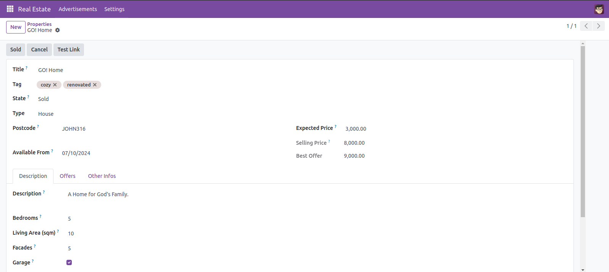


But that's not all. We want our system to handle offers with grace and efficiency. By adding buttons like `"Accept"` and `"Refuse"` to our offer listings, we can streamline the process even further. And when an offer is `accepted`, the magic happens: the buyer is assigned, the selling price is set, all seamlessly orchestrated by the click of a button.


Now, you might wonder, how do we bring this magic to life? It's simpler than you think. We embed these `buttons` into our interface and `link` them `to` Python `methods` that perform the `desired actions`. By marking these `methods as public` and assigning them to the `buttons`, we unleash their power upon our system.

### Guiding Principles: 🌟

Yet, as we venture deeper into the realm of `action buttons`, let us heed a few guiding principles. `Simplicity` reigns supreme; let's resist the allure of unnecessary complexity. `Clarity` and `ease of use` should guide our every decision, ensuring that our system empowers users of all levels.

### A Glimpse of Tomorrow: 🔮

With `action buttons` at our disposal, we stand on the cusp of a new dawn. In the chapters to come, we'll explore how to `prevent incorrect data` from infiltrating our system, fortifying its foundations and ensuring its resilience in the face of real-world challenges.

So, fellow voyager, let us embark on this journey with heads held high, for the path ahead brims with promise and the potential to reshape the landscape of `real estate` management with Odoo 17.

**Notes:**

> In **Chapter 6: Finally, Some UI To Play With**, we created an action that was linked to a menu. You may be wondering if it `is possible to link an action to a button`. Good news, it is! One way to do it is:
> ```xml
> <button type="action" name="your_module.action_name" string="Button Label"/>
> ```

---

## Chapter 10: Constraints

With the dawn of Chapter 9, we embraced the power of `action buttons`, transforming our real estate management system into a dynamic marketplace of possibilities. Yet, as our journey unfolded, we encountered a new challenge: ensuring the integrity of our data amidst the ever-changing currents of user input.

### Safeguarding the Realm: ⚔️

In our quest for data integrity, we discovered the formidable tools of `constraints`. These guardians of `truth` stood as sentinels, warding off the specter of incorrect `data` with unwavering resolve.

### The Arsenal of Constraints: 🛡️

With Chapter 11, we delved deeper into the arsenal of constraints, uncovering two mighty weapons: `SQL constraints` and `Python constraints`. Like knights donning armor, SQL constraints fortified our database with impenetrable barriers, ensuring that amounts remained positive and names stood as unique beacons of identity.

### The Wisdom of Odoo: 📜

Yet, in the labyrinth of data management, `SQL` alone could not suffice. With `Python` constraints, we wielded the wisdom of Odoo to craft intricate spells of logic, guarding against the subtle nuances of incorrect data with precision and finesse.

### An Exercise in Mastery: 🏋️‍♂️

Guided by the hand of Odoo, we embarked on exercises that tested our skills and honed our craft. From ensuring positive prices to safeguarding the uniqueness of property tags, each challenge brought us closer to mastery over our realm of data.

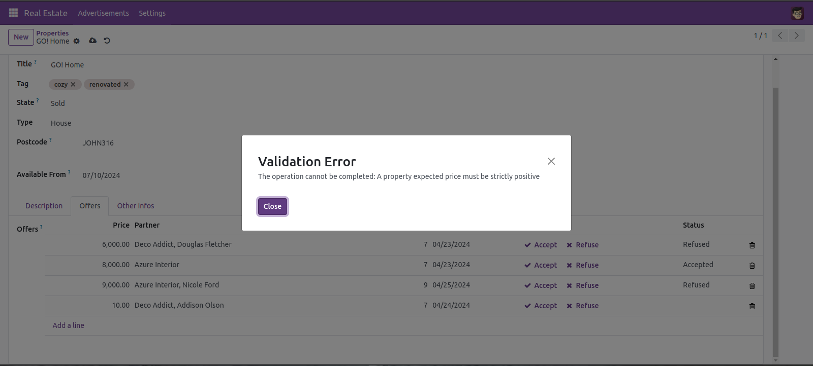

In our quest to perfect our real estate module, we encountered an exercise of great importance: to ensure that **no offer could be accepted if it dared to fall below 90%** of the expected price. With the guidance of Odoo, we crafted a `Python constraint`, leveraging the power of float comparison to safeguard our realm against unwelcome intruders.


### A Cautionary Tale: ⚠️

But amidst our triumphs, a cautionary tale echoed through the halls of our adventure. Odoo warned us to tread carefully when working with floats, urging us to wield the tools of float comparison and precision handling with care and reverence.

### A Journey Unfolds: 🌟

As our tale draws to a close, we stand on the threshold of a new chapter, where the user interface awaits our touch of refinement. With each constraint we add, with every line of code we write, our real estate management system evolves, poised to shape the future of property management with Odoo 17.

---

## Chapter 11: Add The Sprinkles

With the formidable arsenal of constraints now firmly in place, our real estate management system stands as a fortress of `data integrity`, safeguarded against the specter of erroneous input. 

Yet, as our journey through `Odoo 17` continues, we find ourselves at a pivotal juncture: the refinement of our user interface.

In the previous Chapter, we fortified our realm with the formidable tools of SQL and `Python constraints`, ensuring that our data remained pristine amidst the tumultuous currents of user interaction. 

Now, as we gaze upon the landscape of our real estate `module`, we recognize the need to add a touch of `visual flair` and `intuitive functionality` to enhance the user experience.

As we embark upon this Chapter, our mission is clear: to add the final touches that will elevate our real estate `management` system from a mere tool to a delightful and `intuitive` platform for property management.

### Adding Visual Flair:
- We aspire to infuse our `list views` with vibrant `colors`, distinguishing properties with offers received, offers accepted, and those that have been sold or canceled.


- Through the judicious use of color `decorations`, we aim to create a visual language that intuitively conveys the status of each property at a glance.

### Streamlining User Interactions:
- We seek to streamline user `interactions` by dynamically adjusting the `visibility` of buttons and fields based on contextual conditions.


- By employing conditional `visibility attributes`, we can ensure that users are presented with only the most relevant `options` at any given moment, enhancing usability and reducing cognitive load.

### Empowering Efficient Searching:
- We endeavor to empower users with `efficient search` capabilities, enabling them to quickly `filter` properties with `values` based on `specific criteria` such as living area.


- Through the addition of default filters and custom search domains, we aim to streamline the search process, facilitating faster access to relevant property listings.


### Elevating Data Presentation:
- We aspire to elevate the presentation of data within our `forms` and lists, leveraging `inline views` to provide contextual insights and enabling users to interact with related `records` seamlessly.


- By harnessing the power of `widgets`, we can tailor the display of fields to suit the unique requirements of our real estate module, enhancing `clarity` and usability.

### Unveiling Insights with Stat Buttons:
- We recognize the value of providing users with quick access to insightful data, and thus, we seek to implement `stat buttons` that offer a glimpse into key metrics such as the number of offers associated with a specific property type.

- Through the judicious use of `related fields` and custom actions, we aim to unveil actionable insights with a single click, empowering users to make informed decisions.

As we embark upon this journey to add the final sprinkles to our `real estate module`, we do so with a sense of purpose and determination. With each enhancement we introduce, we draw closer to our vision of creating a user experience that is both delightful and `intuitive`, setting the stage for a new era in property management with Odoo 17.

---

## Chapter 12: Inheritance 🏰

After adding the final 🎨 decorative touches to our 🏠 `real estate module` in the previous chapter, we now dive into this chapter to explore even more features that enhance the user experience.

### Inheriting for Innovation:
Like meticulous craftsmen, we seek to refine existing functionalities by exploring 🔗 `inheritance` mechanisms in Odoo. This allows us to ➕ `add new features` while preserving code integrity and system stability.

### Python Inheritance:
Similar to superheroes acquiring new powers, we learn to 🚀 `extend standard methods` of data creation, reading, writing, and deletion.


For example, we now 🚫 prevent the `accidental deletion` of important properties by disallowing the deletion of any property that is not new or canceled.

### Model Inheritance:
Like an artist 🎨 painting a canvas, we ➕ `add new fields` to our existing models to enrich the functionality of our system.

### View Inheritance:
As user experience architects, we 🛠️ `customize` the appearance of our `user interface` by inheriting existing `views` and adapting them to our specific needs.


For example, we ➕ `add a new tab` in the user view to display a list of `available properties`, providing users with quick and intuitive access to relevant information.

😃 With each new improvement we make, we move closer to our goal of creating an exceptional and intuitive user experience.

By `fine-tuning` details, `adding` new features, and `refining` the user interface, we shape Odoo to perfectly meet the needs of our business, paving the way for even more efficient and effective `real estate` management with Odoo 17. 🌟

---

## Chapter 13: Interact With Other Modules 🤝

Building upon the foundation laid in previous Chapter, where we delved into the art of inheritance to enhance our `real estate module`, we now embark on a new journey of `integration` and collaboration.

### Bridging the Gap with Invoicing

As we continue to polish our `real estate` solution, we recognize the need to seamlessly `connect` with other `modules`, unlocking new functionalities and streamlining workflows. In this chapter, our focus shifts towards `integrating` with the `Invoicing module` to automate the `invoice generation` process. 📑💼

### Introducing the Link Module

Just as skilled artisans carefully craft intricate designs, we meticulously design a `'link' module` to bridge our `real estate` and `accounting` functionalities. 


By depending on both the `estate` and `account` modules, this `link module` serves as a conduit for data exchange, ensuring interoperability while maintaining `modularity`. 🌐🔗

### Model Inheritance: Extending Capabilities

In the spirit of innovation, we extend our `real estate` module's capabilities through `model inheritance`. 

By `overriding` the `action triggered` when a property is `sold`, we lay the groundwork for `automated invoice` creation, seamlessly integrating with the Invoicing module. 🚀🏠

### Crafting Invoices with Precision

With the framework in place, we turn our attention to crafting `invoices` with precision. 


Each `invoice` is meticulously populated with essential details such as customer ID and move type, setting the stage for accurate financial transactions. 🧾💳

### Adding Finishing Touches: Invoice Lines

Just as a skilled artist adds brushstrokes to complete a masterpiece, we add `invoice lines` to our invoices. 

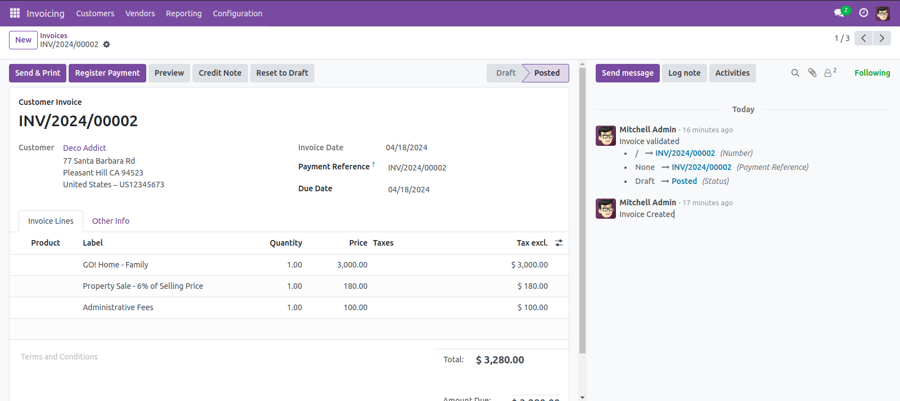


Each line meticulously `captures transaction` specifics, ensuring clarity and accuracy in financial records. 🎨✨


### A Seamless Integration Journey

With each step, our `real estate` solution evolves into a comprehensive and integrated platform. By seamlessly connecting with the `Invoicing module`, we empower users with automated workflows and enhanced efficiency.

As we navigate through this integration journey, we draw closer to our vision of creating a seamless and intuitive real estate management solution with Odoo 17. 🏡🔧

---

## Chapter 14: A Brief History Of QWeb

Building upon the harmonious collaboration achieved in previous chapter, where our `real estate module` intertwined with the `Invoicing module`, we now embark on a quest to infuse our interface with unparalleled charm and flexibility. 🌟

In this chapter, we journey into the mystical realm of `QWeb Templates`, a realm where design and functionality converge in harmony. As we gaze upon the landscape of our `real estate application`, we realize that to truly captivate our users, we must transcend the ordinary and embrace the extraordinary. 🏞️

`QWeb Templates` emerge as our guiding light, offering us the power to weave intricate `designs` and `dynamic templates` with ease. With `QWeb` as our ally, we set out to create a wondrous `Kanban view` for our properties. 🎨

In the enchanted land of Odoo, a `Kanban view` is no mere display of data; it `is a canvas` upon which we paint our dreams and aspirations. With each stroke of our virtual brush, we bring life to the cards, infusing them with meaning and purpose. 🖌️


As we delve deeper into the mysteries of `QWeb`, we discover the art of `conditional display`, allowing our properties to reveal their secrets only when the time is right. Through the `t-if` directive, we wield the power to create dynamic and engaging interfaces that respond to the whims of our users. 🎭

But our journey does not end there. With the knowledge gained from our adventures in QWeb, we embark on a quest to improve our `Kanban view` further. We adorn it with treasures such as expected price, best price, selling price, and tags, transforming each card into a masterpiece of information and insight. 💼

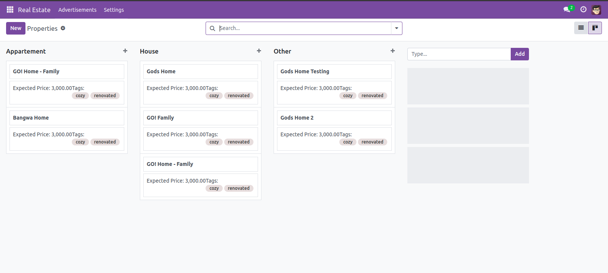

And as the final touch to our masterpiece, we invoke the ancient magic of `default grouping`, arranging our properties by type with effortless grace. With a wave of our wand, we create harmony amidst chaos, ensuring that each card finds its rightful place in the grand tapestry of our `real estate` application. 🌌

As our journey through the realm of `QWeb` comes to a close, we emerge as masters of `interface design`, armed with the knowledge and skills to create captivating and immersive experiences for our users. With `QWeb` as our guide, we continue to push the boundaries of what is possible, forging new paths and unlocking new horizons in the world of `Odoo development`. 🚀

---

## Chapter 15: The final word

As our journey through the realm of `Odoo` nears its conclusion, we stand on the precipice of greatness, poised to embark on one final quest: the `pursuit of perfection` in our code. 🏰

Guided by the ancient principles of the [Odoo coding guidelines](https://www.odoo.com/documentation/17.0/contributing/development/coding_guidelines.html), we set forth to refine our creations and elevate them to new heights of excellence. These `guidelines`, like the sacred scriptures of our craft, are a roadmap to `improving the quality` of our `Odoo Apps code`. 📜✨

With each line of code we `refactor`, we breathe life into our creations, imbuing them with the essence of best practices and standards. We meticulously adhere to the `module structure`, ensuring that our `code is organized` and easy to navigate. We choose `variable names` with care, selecting words that convey meaning and `clarity`. Our method names follow a convention that speaks to the heart of `readability` and `coherence`. 💻🔍

As we `polish our code` to a brilliant sheen, we heed the call to run our `linter`, the vigilant guardian of `code quality`. With its watchful eye, we detect and rectify any deviations from the `guidelines`, ensuring that our code stands as a paragon of excellence. 🛡️🔧

But our journey does not end there. With our code refined and perfected, we turn our gaze towards the horizon and behold the majestic [runbot](https://runbot.odoo.com/), `Odoo's` own `guardian` of stability and reliability. Here, on this sacred ground, every commit, branch, and pull request undergoes `rigorous testing` to prevent `regressions` and uphold the sanctity of the `stable versions`. 🤖⚙️

In the realm of the `runbot`, we witness the culmination of our efforts, as each `successful test` run heralds the birth of a new iteration of `Odoo`, infused with the spirit of our dedication and craftsmanship. 🎉🌟

And so, dear traveler, as our odyssey draws to a close, we invite you to join us in this final act of exploration. Journey to the [runbot website](https://runbot.odoo.com/), where the fruits of our labor await your inspection. Behold the last `stable version of Odoo` in all its glory, and marvel at the myriad applications and functionalities that embody the spirit of our quest for perfection. 🚀🔍

SEE YOU NEXT 😃

---

## Contributing

### Coding guidelines

Once upon a time in the kingdom of Odoo, there were sacred rules known as the `Coding Guidelines`. These guidelines were like magic spells that aimed to make the code of Odoo Apps shine brighter than the stars. 🌟

You see, `proper code` was more than just lines on a screen; it was the key to unlocking the secrets of `readability`, the sword that vanquished `complexity`, and the shield that guarded against `bugs`. And so, every developer who dared to venture into the realm of Odoo was expected to abide by these `guidelines`, for they held the secrets to crafting `software` of the highest `quality`.

But heed this warning, dear reader: when treading upon the paths of `stable versions`, thou shalt not tamper with existing files! For the style of those files is sacred, and any attempt to alter them would disrupt the very fabric of `revision history`. Keep thy changes minimal, and let the `original style` reign supreme.


#### Module structure

And in the land of `directories`, where modules took shape, there lay the heart of business logic. From `data` to `models`, `controllers` to `views`, each directory whispered its purpose to those who dared to listen. 

And `file naming`? Ah, a tale as old as time itself! For in Odoo, the names of files were like breadcrumbs leading developers on a journey of `understanding`. Whether it be models or security, views or wizards, each file bore a name that revealed its `true essence`.

But let us not forget the stories of `controllers` and static files, where `JavaScript` and templates danced in harmony, each with its own place in the grand tapestry of code. And `wizards`, with their `transient models` and views, added a touch of magic to the world of Odoo.


So, dear reader, as you embark on your quest through the documentation of Odoo 17, remember these tales of the `Coding Guidelines`. For they are not mere rules to be followed, but the very essence of craftsmanship in the enchanted kingdom of code. 🏰✨✨

#### XML files

Once upon a time in the bustling kitchen of Odoo, there existed a language known as `XML`, akin to the recipes that held the very essence of culinary creations.

In this lively kitchen, `XML files` were like well-worn cookbooks, each containing the recipe for a delightful dish of Odoo. But fear not, for even the novice chef could decipher their secrets with the help of the `XML Format`.

Behold, the `<record>` notation, a powerful recipe that brought forth new flavors into the kitchen of Odoo. With it, one could declare `views`, `actions`, and even `menus` with ease. But remember, young chef, to season with the `id` attribute before the `model`, for it is the key to unlocking the flavor within.

And what of ingredients, you ask? Ah, their declaration was a dance of syntax, where the `name` attribute led the way, followed by the `value` in the `field` tag or `eval` attribute. And let us not forget the other attributes, `ordered by importance`, for they too played a role in shaping the taste of Odoo.

But wait! There are shortcuts, dear chef, shortcuts that can save you from the labyrinth of `XML`. The `menuitem` and `template` tags, acting as sous-chefs in the kitchen, allow you to declare `menus` and `QWeb views` with but a few ingredients.

Now, onto `XML IDs` and `naming`, a topic as vast as the pantry itself. For `menus`, `views`, and `actions`, there exists a recipe, a recipe that ensures `clarity` and `understanding` in the kitchen of Odoo. And let us not forget `security`, where `groups` and `rules` are named with care, each bearing the mark of its culinary purpose.

But what of `inheritance`, you ask? Fear not, for even in the world of `XML`, there exists a path for the brave. `Inheriting XML` is a tale of flavors and combinations, where `IDs` remain the same, yet hold the power of transformation within.

So, young chef, as you journey through the kitchen of Odoo, remember these tales of `XML`. For they are the recipes to unlocking the flavors that lie within, guiding you on your quest to become a master of the culinary arts. 🍳👨‍🍳

#### Python

Once upon a time in the vibrant world of Odoo, there existed a magical language known as `Python` 🐍, where developers wielded the power of code to bring their digital creations to life.

But heed this warning, dear coder, for the path of Python is fraught with peril! Do not venture forth without first acquainting yourself with the `Security Pitfalls` section 🚨, for it holds the secrets to writing code that guards against nefarious forces.

Now, imagine a realm where code is not just lines on a screen, but a symphony of structure and `style`. Enter the world of `PEP8` options, where a `linter` acts as a vigilant guardian, ensuring that your code adheres to the `standards` of the Python elders 📏. Though some rules may seem arbitrary, they serve to maintain order and `clarity` in the land of code.

Behold, the `Imports`, an organized procession of `external` libraries, `Odoo` essentials, and `module` treasures 📚. Like ingredients in a grand feast 🍲, they are arranged with care, each serving a specific purpose in the grand recipe of your code.

But what of the `Idiomatics of Programming`, you ask? Ah, here lies the heart of `Pythonic wisdom`! From the humble creation of `dictionaries` to the art of `list comprehensions`, these are the guiding principles that transform mere code into `elegant expressions` of logic and clarity ✨.

And let us not forget the `Symbols` and `Conventions`, where even the naming of variables and methods follows a sacred tradition 🏛️. From `camelcase` in Python classes to the meticulous `ordering` of attributes and methods within a model, every detail serves to honor the craftsmanship of coding.

But beware, young developer, for the road ahead is fraught with challenges. Do not be tempted by the allure of `manual commits` or the misuse of translation methods, for they may lead you down a treacherous path of `broken code` and `lost data`.

In the realm of Odoo, where the digital pursue the perfection, remember these tales of Python. For they are the keys to unlocking the `full potential` of your code, `guiding` you on your quest to become a master of the craft 🛠️.

#### JavaScript


Once upon a time, in the bustling kitchen of Odoo, where digital recipes were concocted, there existed a special ingredient known as `Javascript`. But much like any culinary craft, it had its own recipe book and kitchen `rules`, guiding the chefs as they whipped up their digital delicacies 🍳.

In this savory realm of `web development`, where ingredients danced on the digital stove, the organization of `static files` was akin to the meticulous arrangement of ingredients on a chef's cutting board 🥕. Within the pantry of the `static folder`, each file had its designated shelf, carefully arranged according to the culinary `conventions` of the Odoo chefs.

Enter the pantry's `library` section, a treasure trove of culinary knowledge where the whispers of seasoned recipes like `jQuery` and others could be heard. Here, within its hallowed shelves, chefs sought the wisdom of the culinary elders to enrich their creations.

But the journey didn't end there, for beyond the `libraries` lay the heart of the kitchen - the ingredients cupboard 🌶️. Within its shelves dwelled the source ingredients, divided into sacred sections of spices, herbs, oils, and more.

And so, the chefs were reminded to embrace the culinary `traditions` of strict measurements and the `guidance` of kitchen tools 🧊. For in the world of `Javascript`, adherence to the culinary `rules` was paramount, ensuring that the recipe remained pure and free from error.

But heed this warning, dear chefs: never succumb to the temptation of `prepackaged` ingredients, for they are but shadows of their fresh counterparts, lacking the flavor that once made them great.

Armed with the knowledge of `Javascript` culinary `guidelines`, the chefs ventured forth into the digital kitchen, their code a flavorful dish in the banquet of the `web`. For in the kitchen of Odoo, where digital recipes are cooked to perfection, it is the code that seasons the feast of digital experiences 🍽️.

#### CSS and SCSS

Once upon a `webpage`, in the land of Odoo, where digital `designs` flourished like gardens in springtime, there existed a realm known as `CSS` and `SCSS`. Here, amidst the `cascading stylesheets` and the flavorful `SCSS mixins`, a tale of syntax, formatting, and naming conventions unfolded.

Imagine, if you will, the kitchen of a master chef, where every utensil has its designated place, and every recipe follows a precise order of preparation. Similarly, in the world of `CSS` and `SCSS`, `indentation` ruled with four-space indents, ensuring that each line of code stood in its rightful place, much like ingredients lined up on a chef's cutting board 🍽️.

But let us delve deeper into this culinary adventure. Just as a chef meticulously orders the sequence of cooking steps, so too must the web developer organize `properties` in their `CSS` and `SCSS` files. From the outside in, starting with the position and ending with decorative rules, each declaration found its place in the `digital cookbook` 📜.

And what of the `naming conventions`, you ask? Much like labeling ingredients in jars, `CSS classes` were prefixed with `'o_'` followed by the `module name`, ensuring transparency and clarity in the code. Just as a chef avoids cluttering the kitchen with hyper-specific ingredients, web developers refrained from creating overly specific `classes`, opting instead for a more concise and `maintainable approach`.

But the true magic lay in the `variables` - the seasoning that brought flavor to the dish of `design`. In the world of Odoo, `SCSS variables` followed a sacred naming convention, ensuring `harmony` and `consistency` in the digital kitchen. Meanwhile, CSS variables danced across the `DOM`, adapting the design and layout to specific `contexts`, much like a skilled chef adjusting the recipe to suit the occasion.

As the tale unfolds, we witness the convergence of `CSS` and `SCSS`, blending the best of both worlds like a perfect fusion dish. `SCSS variables` laid the foundation of the `design system`, while `CSS variables` added a touch of `contextual adaptation`, creating a harmonious symphony of style.

And so, dear reader, as we bid adieu to this culinary journey through the world of CSS and SCSS, let us remember that much like cooking, `web development` is an art form where creativity and precision go hand in hand. 🎨✨

---

### Git guidelines

In the vast realm of Odoo, where developers journey through lines of code like explorers navigating uncharted lands, there exists a sacred tradition known as `Git guidelines`. Passed down through generations of programmers, these guidelines serve as a beacon of order amidst the ever-changing sea of code.

🌟 Picture, if you will, a seasoned chef preparing a gourmet meal. Just as the chef meticulously organizes ingredients and follows a recipe, so too must developers configure their `Git settings`. By defining user `email` and `name`, developers establish their `identity` in the digital kitchen, ensuring that each `commit` carries their mark 🍳.

But what of the `commit message`, you ask? Much like a chef composing a menu, a commit message comprises four parts: tag, module, short description, and full description.

#### Tag and module name

🏷️ `tags`, much like labels on different compartments of a toolbox. Each `tag` serves a specific `purpose`, from fixing `bugs` to adding new `features` or even `reverting` changes that have caused unforeseen `issues`. These tags provide clarity and organization, ensuring that every commit is categorized appropriately.

But `tags` alone are not enough. Just as a craftsman carefully selects the right tool for the job, developers must craft meaningful `commit message headers`.

#### Commit message header

Picture yourself as a storyteller, crafting the beginning of a tale that sets the stage for an epic journey. In the realm of Odoo development, every `commit message` is like the opening line of a story, offering insight into the `purpose behind each change`.

As the protagonist of this narrative, the `commit message header` takes center stage after the tag and module name. It's not just a label slapped onto a package, but rather a `concise summary` that hints at the adventure to come. 

Avoid the temptation to use vague terms like `"bugfix"` or `"improvements"` – instead, strive for `clarity` and `brevity`. Imagine your header as the opening scene of a play, succinctly capturing the essence of the change in about `50 characters`. 

🌟 `If applied, this commit will...` and let your `header` complete the sentence with clarity and purpose. Whether it's fixing a bug, adding a new feature, or making improvements, each `commit message` sets the tone for the next chapter in the development saga.

#### Commit message full description

Imagine yourself as a seasoned bard 🎶, weaving tales of `code changes` and development quests in the land of Odoo. Every commit message is like a chapter in a grand saga, telling the story of why and `how` the code was `transformed`.

As the hero of this narrative, the `commit message full description` holds great power. It serves as the guiding star for future adventurers 🌟 who may journey back to your commit in search of wisdom. 

Begin by unraveling the mystery behind your code modifications. `Why` did you embark on this quest? `What purpose` does your change serve in the greater scheme of things? 

Remember, `clarity` is your sword 🗡️, and `verbosity` your shield 🛡️ – don't hesitate to share the tale behind your journey.

While the `commit` itself reveals the `technical changes`, the `commit message` is your chance to shed light on the path you've chosen. Were there any `forks` in the road? Any `crucial decisions` that led you to this point? Share your insights with future travelers 🚀, for they may benefit from your wisdom.

Every `commit` should focus on a `single module`, avoiding the tangled webs of multi-module changes. By splitting your quests into `separate commits`, you create a clearer roadmap 🗺️ for future explorers, allowing them to navigate each `module's history` with ease.

And remember, fellow developer, the importance of your words cannot be overstated. Craft your `commit messages` with care, for they are the legacy you leave behind. Whether it's a `refactor`, a `bug fix`, or an `improvement`, let your message echo through the halls of code, guiding and inspiring those who follow in your footsteps.

And so, dear reader, as we conclude this tale of `Git guidelines` in Odoo, let us remember the lessons learned from the culinary world. Just as a well-crafted dish delights the palate, a well-composed `commit message` brings clarity and understanding to the realm of code. 🖥️🍽️

---

## Odoo Studio

### Chapter 1 : Fields and Widgets in Odoo

Imagine you're designing a database model. Picture it as a table or a spreadsheet. Here, fields are like the columns, storing specific types of data in each row (record). 

The type of data a field holds and how it's presented on the user interface (UI) is defined by its widget. 📊

Odoo offers 15 types of fields from a technical perspective, but Studio expands this choice to 20 by offering some field types multiple times with different default widgets.

Let's break down these fields and their widgets in simple terms. 🛠️

#### Simple Fields in Odoo

1. **Text (char) ✉️ 📞 🌐**: 
   - Stores short text. 
   - Widgets include Badge (non-editable tag), Copy to Clipboard, Email (clickable mailto link), Image (URL-based), Phone (clickable tel link), and URL (clickable link). 

2. **Multiline Text (text) 📝**: 
   - For longer text. 
   - Includes Copy to Clipboard widget. 

3. **Integer (integer) 🔢 📊**: 
   - Stores whole numbers. 
   - Widgets include Percentage Pie, Progress Bar, and Handle (for ordering records). 

4. **Decimal (float) 💸 ⏲️**: 
   - Stores decimal numbers. 
   - Widgets include Monetary, Percentage, Percentage Pie, Progress Bar, and Time (hh:mm format). 

5. **Monetary (monetary) 💶**: 
   - For monetary values. 
   - Requires a Currency field. 

6. **Html (html) 🌐**: 
   - Editable text with HTML. 
   - Option to disable the HTML editor.

7. **Date (date) 📅**: 
   - Select a date from a calendar. 
   - Widget includes Remaining Days. 

8. **Date & Time (datetime) 📅⏰**: 
   - Select both date and time. 
   - Widgets include Date (only date shown) and Remaining Days. 

9. **Checkbox (boolean) ✅🔲**: 
   - True or false value. 
   - Widgets include Button and Toggle. 

10. **Selection (selection) ⭐ 📻**: 
   - Choose from predefined values. 
   - Widgets include Badge, Badges, Priority (star rating), and Radio buttons. 

11. **Priority (selection) ⭐⭐⭐**: 
   - Three-star rating system, similar to a selection field with predefined values. 

12. **File (binary) 📂 🖼️ 📄**: 
   - Upload any file or sign a form. 
   - Widgets include Image, PDF Viewer, and Sign. 

13. **Image (binary) 🖼️**: 
   - Upload and display images. 
   - A specific type of File field. 

14. **Sign (binary) ✍️**: 
   - Electronically sign a form. 
   - A specific type of File field. 

#### Relational Fields in Odoo

1. **Many2One (many2one) 🔗📻**: 
   - Link a record from another model. 
   - Widgets include Badge and Radio buttons. 

   - 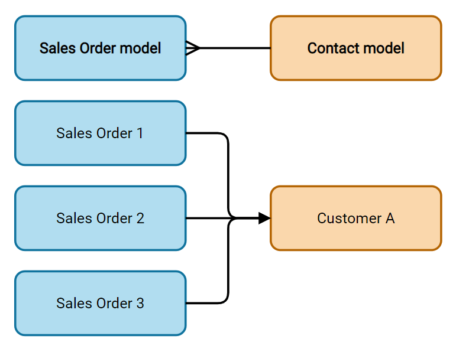 

1. **One2Many (one2many) 🔗🔗**: 
   - Display multiple related records. 
   - Needs an existing Many2One link. 
   - 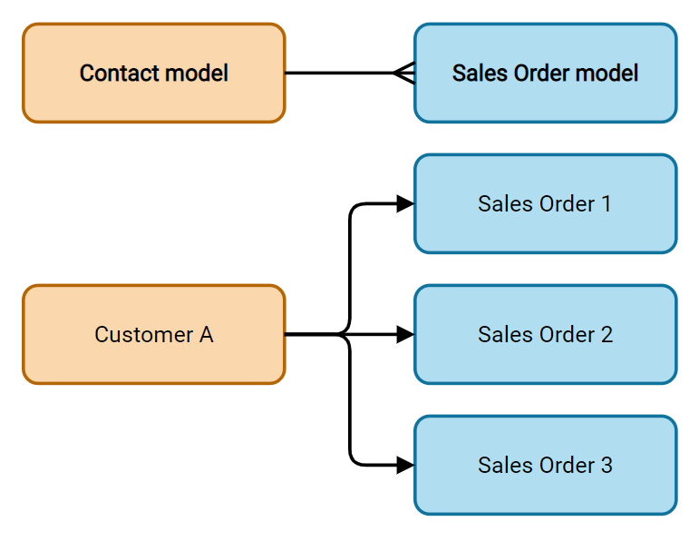 

2. **Lines (one2many) 📝📊**: 
   - Create a table with rows and columns. 

3. **Many2Many (many2many) ✅🏷️**: 
   - Link multiple records from another model. 
   - Widgets include Checkboxes and Tags. 
   - 

4. **Tags (many2many) 🏷️**: 
   - Display multiple values as tags. 
   - A specific type of Many2Many field. 

5. **Related Field (related) 🔄**: 
   - Fetch and display information using an existing relationship. 

### Field Properties

1. **Invisible**: Hide fields from the UI when not necessary. 👻
2. **Required**: Ensure fields are filled before proceeding. 🚦
3. **Read only**: Make fields non-editable. 🔒
4. **Label**: Display name of the field on the UI. 🏷️
5. **Help Tooltip**: Explain the field's purpose with a tooltip. ℹ️
6. **Placeholder**: Provide example text in the field. 💡
7. **Widget**: Change the field's appearance or functionality. 🎨
8. **Default value**: Set a predefined value for new records. 🆕
9. **Limit visibility to groups**: Restrict field visibility to specific user groups. 🔐

By understanding and configuring these fields and widgets in Odoo 17, you can create a robust and user-friendly database model, tailored to your specific needs. 🏗️💼

Here's a summary of the "Views" section in the Odoo 17 documentation, now with some emojis to make it more engaging:

---

### Chapter 2 : Views in Odoo 17 🌐

Views in Odoo are like different lenses through which you can look at your data. 

Imagine you have a treasure chest of information, and views are the various ways you can arrange and display that treasure to make it useful. 

Each model, which you can think of as a type of data collection (like contacts or sales orders), can have several views to present the same data differently. 

In Odoo Studio, views are grouped into four main categories: general, multiple records, timeline, and reporting. 🌟

#### General Views 📋

1. **Form View** ✍️
   - This is used for creating and editing individual records, such as adding a new contact or editing a product. 
   - You can organize the form using tabs and columns and control user permissions to create, edit, or delete records.
   - 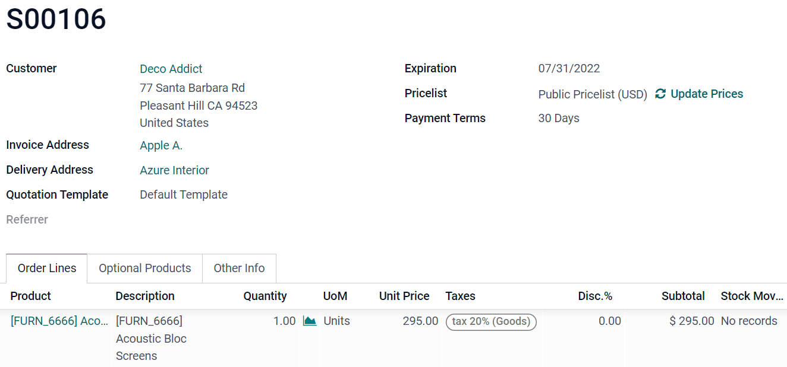

2. **Activity View** 📅
   - This view is for scheduling and viewing activities (like emails and calls) related to records. 
   - To modify it, you need to dive into XML code in `Developer mode`.
   - 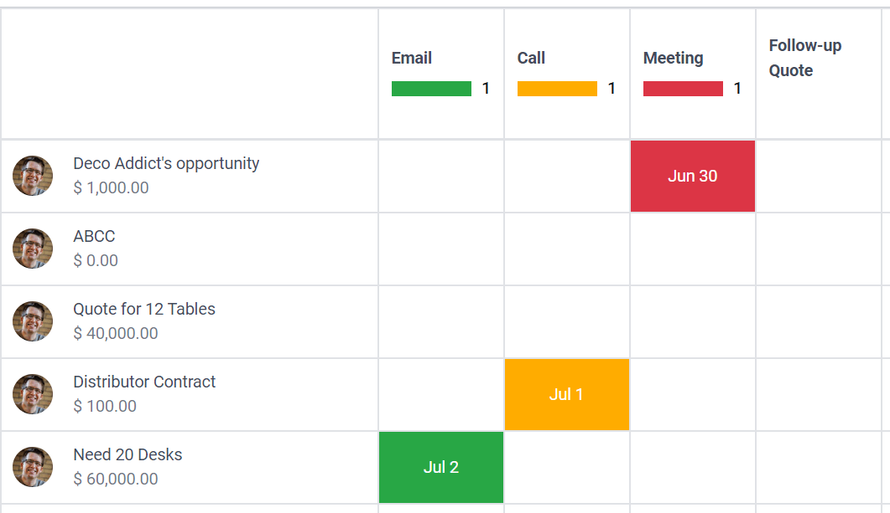

3. **Search View** 🔍
   - This view helps you filter, group, and search through records. 
   - You can add custom filters and set up autocomplete fields for a smoother search experience.
   - 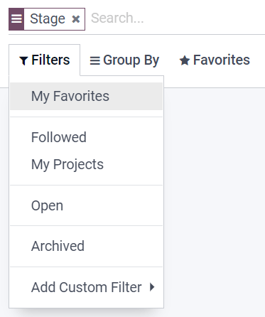


#### Multiple Records Views 📊

1. **Kanban View** 🗂️
   - Ideal for managing workflows, this view displays records as cards that you can move across stages. 
   - It’s especially handy for tasks and project management. 
   - On mobile devices, Kanban view is the default instead of the List view.
   - 
   - 

2. **List View** 📑
   - This view lets you see many records at once, making it easy to search and edit simple records. 
   - You can enable mass editing, sort records, and control user permissions for creating, editing, or deleting records.
   - 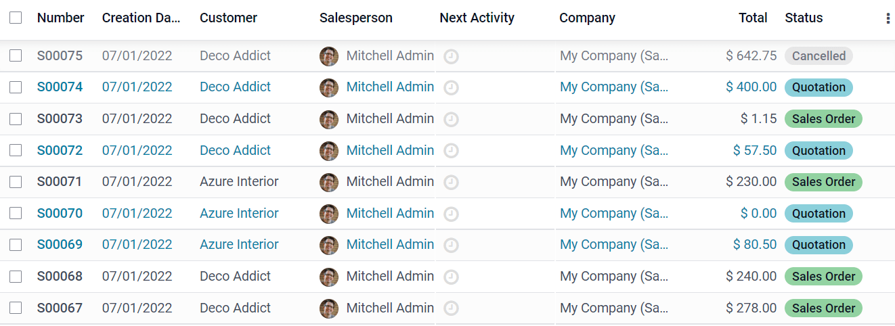

3. **Map View** 🗺️
   - This view shows records on a map, useful for planning routes in field service applications. 
   - You need a link to contact addresses to position the records correctly.
   - 

#### Timeline Views ⏳

1. **Calendar View** 📆
   - Perfect for managing records that need scheduling, this view displays records in a calendar format. 
   - You can enable quick creation of events and color-code records for easy identification.
   - 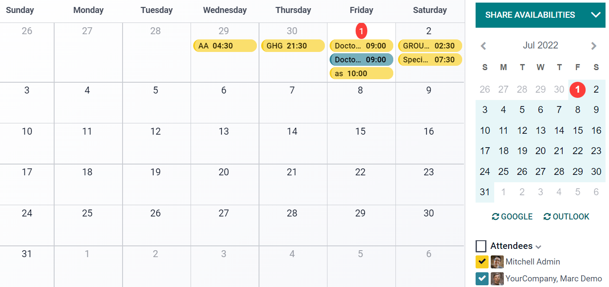

2. **Cohort View** 📈
   - This view analyzes the lifecycle of records over time, useful for understanding trends like customer retention in subscription services.
   - 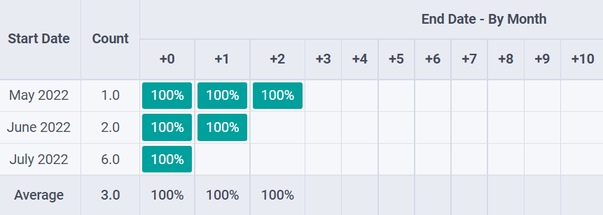

3. **Gantt View** 📅
   - Used for project planning, this view shows records as bars on a timeline, helping you track progress and manage schedules. 
   - You can customize it to show unavailable times (like weekends) and group records by categories.
   - 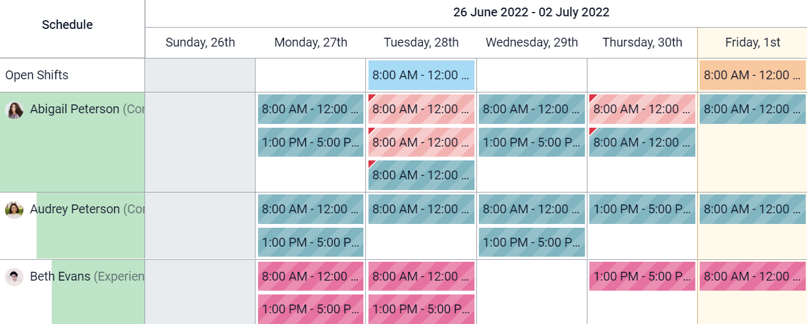

#### Reporting Views 📊

1. **Pivot View** 📊
   - A powerful tool for data analysis, this view allows you to aggregate and explore numeric data. 
   - You can group data by rows and columns and measure various fields to gain insights.
   - 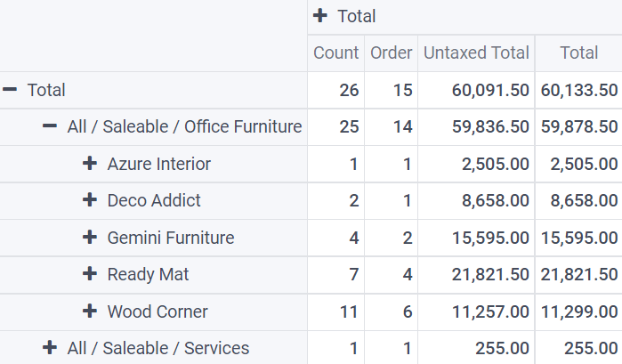

2. **Graph View** 📉
   - This view displays data in bar, line, or pie charts. 
   - You can choose the default chart type, sort data, and access records directly from the chart.
   - 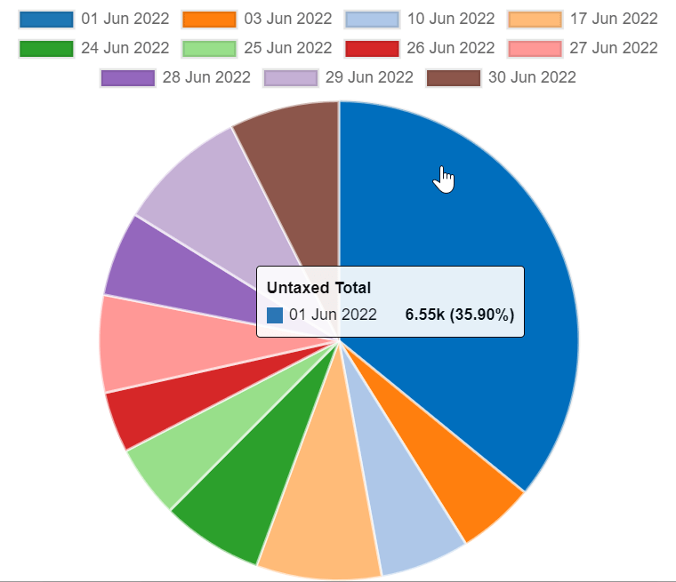

3. **Dashboard View** 📊
   - This view combines multiple reporting views and key performance indicators into one comprehensive display, giving you an overview of important metrics at a glance.
   - 

#### Tips for Modifying Views 🛠️

- To change a model's default view, navigate to Studio, select Views, use the dropdown menu (⋮), and choose "Set as Default."
- For advanced customization, use the built-in XML editor in Developer mode. 
- However, avoid modifying standard views directly; instead, create and edit inherited views to ensure changes persist through updates.

By understanding and utilizing these different views in Odoo 17, you can effectively manage and display your data, tailoring the experience to meet your specific needs. 💡

---

### Chapter 3 : Models, Modules and Apps in Odoo 17 🛠️✨

In the world of Odoo 17, models, modules, and apps are the fundamental `building blocks` of your data universe. 

Let's dive into their roles and how they shape your business processes, all in an easy-to-understand language.

#### Models: The Backbone of Your Data 📊

Imagine `models` as the skeletons of your database, defining its `structure` and how data is stored and manipulated.

Each model represents a table, and these tables are interconnected to represent various business concepts like sales orders, contacts, or products. 

Think of models as the blueprints for organizing your information logically and efficiently.

#### Modules and Apps: The Builders of Your System 🧩

Modules and apps are like the construction workers that bring your blueprints to life. 

They contain all the necessary elements—models, views, data files, web controllers, and static web data—to create a functional and interactive system. 

While all apps are essentially modules, the term `"apps"` usually refers to larger, standalone modules, whereas other modules often act as add-ons to enhance these apps.

#### Turbocharge Your Development with Suggested Features ⚙️🚀

When creating a new model or app using `Odoo Studio`, you can opt for up to 14 `features` to streamline the process. 

These features bundle fields, default settings, and views commonly used together, offering standard `functionalities` from the get-go. 

Although most features can be added later, incorporating them early simplifies the model creation process and enhances their interaction.

#### Key Features to Enhance Your Models 🌟

1. **Contact Details** 📇: Adds fields for linking to contacts, including phone and email, and activates the Map view.
2. **User Assignment** 👤: Allows assigning tasks to internal users and displaying their avatars.
3. **Date & Calendar** 📅: Introduces a Date field and activates the Calendar view.
4. **Date Range & Gantt** 🗓️: Adds start and end date fields and enables the Gantt view.
5. **Pipeline Stages** 📈: Activates the Kanban view with stages like New, In Progress, and Done.
6. **Tags** 🏷️: Adds tagging capabilities to your forms and lists.
7. **Picture** 🖼️: Allows adding images to the top-right of forms.
8. **Lines** 📋: Incorporates a Lines field inside a Tab component.
9. **Notes** 📝: Introduces an HTML field for notes.
10. **Monetary Value** 💰: Adds fields for monetary values and activates Graph and Pivot views.
11. **Company** 🏢: Useful for multi-company environments, adds a company field.
12. **Custom Sorting** 🔄: Enables manual reordering of records with a drag handle.
13. **Chatter** 💬: Adds messaging, note logging, and activity scheduling functionalities.
14. **Archiving** 📦: Introduces the ability to archive records and hide them from searches by default.

#### Export and Import Customizations 🌍

Once you've customized your models using Studio, you can export these customizations as a module named "`Studio customizations`".

This makes it easy to transfer your customizations to another database. 

Simply export your customizations from the main dashboard, download the `ZIP file`, and import it into the new database.

#### A Word of Caution ⚠️

Before importing customizations, ensure that the destination `database` contains the `same apps` and modules as the source. 

Studio customizations do not automatically add underlying modules as dependencies.

With these tools and features at your disposal, crafting your data in Odoo 17 becomes a seamless and intuitive experience, even for those new to the world of databases. Happy building! 🚀

---

### Chapter 4 : Automation Rules in Odoo 17 🛠️✨

Imagine a world where your routine tasks are handled `automatically`, freeing up your time for more important work. 

This is the magic of `automation rules` in Odoo 17, where you can set up automatic changes triggered by user actions, email events, time conditions, or external events.

Let's explore how these automation rules work in a straightforward and simple way.

#### Getting Started with Automation Rules 🎯

To begin, open `Studio` and navigate to `Automations`.

Click on "`New`" to create a new rule. Choose your `Trigger`, fill in the necessary fields, and then define the action you want to occur. 

Save your rule, and you're done! It's as simple as that. 🚀

#### Triggers: When Should the Automation Happen? 🕰️

Triggers define when your automation rule will kick in.

There are five main types:

1. **Values Updated** 🔄: Triggers based on changes to specific fields, like adding a tag or setting a user. 
2. **Email Events** 📧: Triggers when emails are sent or received. 
3. **Timing Conditions** 📅: Triggers based on dates, like sending a reminder before an event. 
4. **Custom** 📝: Triggers based on saving, deleting, or UI changes. 
5. **External** 🌐: Triggers based on external events via webhooks. 

#### Setting Up Actions: What Should Happen? 🛠️

Once you have defined your `trigger`, you need to specify what action should occur. 

Here are the types of actions you can set up:

1. **Update Record** ✍️: Modify the fields of a record. 
2. **Create Activity** 📅: Schedule a new activity linked to the record. 
3. **Send Email and Send SMS** ✉️📲: Automatically send emails or text messages. 
4. **Add Followers and Remove Followers** 👥: Manage who follows a record. 
5. **Create Record** 📄: Generate a new record in any model. 
6. **Execute Code** 💻: Run custom Python code. 
7. **Send Webhook Notification** 🌐: Send data to an external system. 
8. **Execute Existing Actions** 🔗: Trigger multiple actions at once. 

#### Advanced Features and Tips 💡

- **Before Update Domain** 🔍: Set conditions that must be met before the automation rule is triggered. 
- **Extra Conditions** ✅: Add additional criteria that must be satisfied for the rule to execute. 
- **Logging** 📝: Keep track of the data sent by external systems to ensure everything runs smoothly. 

#### Practical Examples 🌟

Let's say you want to automate the process of archiving old records. 

You could set up a timing condition to trigger this action 7 days after the last update. 

Or, if you need to send a reminder email 30 minutes before a meeting, you can create a timing condition based on the event's start time. ⏰📧


#### Webhooks: Connecting with External Systems 🌐

Webhooks are powerful tools for integrating Odoo with external systems. 

They work by sending HTTP(S) requests to a specified URL when certain events occur. 

This allows you to automate actions based on data from other applications, ensuring seamless communication between your systems. 🤝

#### Conclusion

Automation rules in Odoo 17 are like having an assistant who handles `repetitive` tasks for you. 

By setting up these `rules`, you can streamline your `workflow`, save time, and ensure that critical `actions` are taken `automatically`. 

Whether you're updating records, sending notifications, or integrating with external systems, `automation rules` make it all possible. 

Start building your automation rules today and watch your `productivity` soar! 🚀✨

---

### Chapter 5 : PDF Reports in Odoo 17 🛠️📄

Imagine having the power to create and `customize` PDF reports that perfectly reflect your company's style and needs. 

With Odoo 17's `Studio`, you can do just that, making professional and `personalized reports` for invoices, quotations, and more. 

Let's dive into this journey of transforming how you `present` your business `data`.

#### Default Layout: Setting the Stage 🎨

The journey begins with setting up the default layout for your reports. 

Head to the Settings and under the Companies section, click **Configure Document Layout**. 

Here, you can choose from four `layouts`: Light, Boxed, Bold, and Striped. You can also select from seven fonts, such as Lato and Roboto, and upload your company logo. 

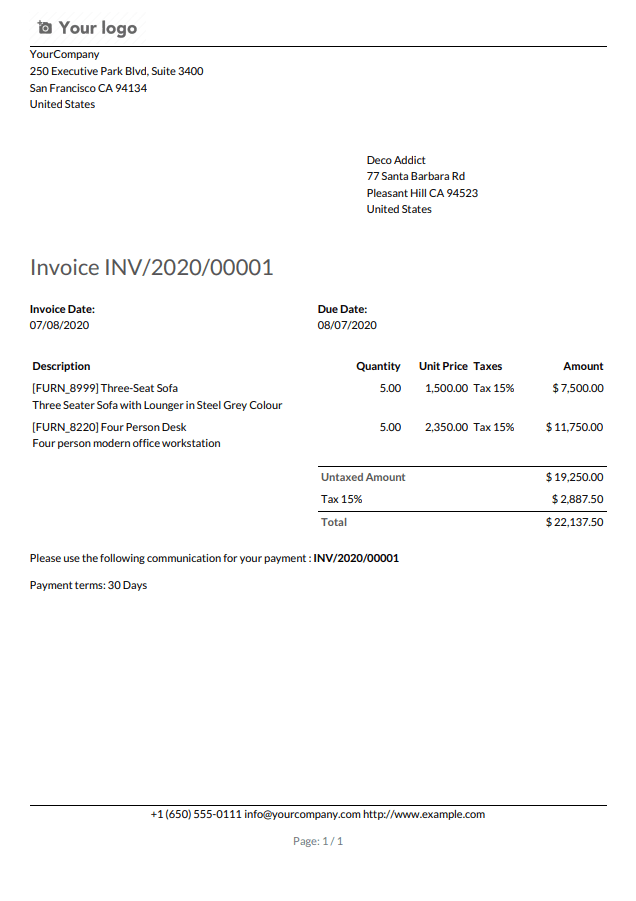


Adjust the primary and secondary `colors`, choose a background (like Geometric or Custom), and add your company's tagline and details. 

This setup applies to all your reports, ensuring `consistency` across your documents. 

#### Creating New PDF Reports: Starting Fresh 📝

When you need a new report, navigate to the relevant model, toggle Studio, and click on **Reports**. 

Click **New**, and choose the type of report: `External` (with a company logo and footer details), `Internal` (with user and company info), or `Blank` (no header or footer). 

Once created, you can start editing the report to fit your needs.

#### Editing PDF Reports: Making It Your Own ✂️

To edit an existing report, select it from the Reports section in Studio. 

It's recommended to `duplicate` the standard report first, ensuring the original remains unchanged. 


Use the options on the left to `rename` the report, change its paper format, and set its `visibility` to specific user groups. 

You can also add the report to the **Print** menu and `reset` it to its default state if needed.

#### Report Editor: Tools at Your Fingertips 🛠️

The `report editor` is where the real customization happens. You can `modify` formatting and content directly. 

Use commands to add fields, tables, images, and more. Type `/` to open the powerbox and choose what you need. 

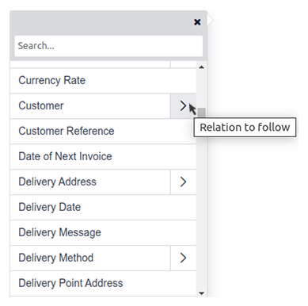

For instance, add a field by selecting the **Field** command, find the field you want, and insert it. 

Similarly, add `data table`s to display relational fields, and format your text using the text editor.

#### Conditional Blocks and Dynamic Content 🔄

Conditional blocks (dashed rectangles) let you show or hide content based on specific conditions. 

For example, display different information depending on the status of an order. 

These `conditions` are set in `XML`, but you can `preview` and adjust them in the editor.

Dynamic text, highlighted in blue, automatically updates with field values when the report is generated. 

For instance, the SO number or quotation date will appear `dynamically` in the final report.

#### Advanced Customization: Editing XML 💻

For those needing advanced customization, you can edit the report's `XML` directly. 

This allows for precise `control` over the report's structure and content. 

However, be `cautious`, as direct XML edits might cause issues during system upgrades. If problems arise, simply copy your changes from the old `database` into the new one.

#### Conclusion 🚀

Creating and editing PDF reports in Odoo 17 is like painting a masterpiece. 

With Studio, you have the tools to craft documents that are not only `functional` but also `beautifully` tailored to your business's identity. 

From setting up the default `layout` to diving deep into `XML` edits, Odoo empowers you to present your `data` in the best possible light. 

Start your journey today and see how easy it is to create stunning `reports` that make an impact. 🚀📊

---

## Odoo SH

### Chapter 1: Introduction to Odoo.sh 🚀☁️

After mastering the art of customizing Odoo 17 with `Odoo Studio`, it's time to delve into the powerful world of `Odoo.sh`. 

Odoo.sh is a comprehensive platform-as-a-service (PaaS) designed to make deploying, managing, and scaling your Odoo applications a seamless experience. 

Let's embark on this journey to understand how `Odoo.sh` can revolutionize your Odoo development and deployment process.

#### What is Odoo.sh ? 🌐

`Odoo.sh` is a cloud platform tailored specifically for Odoo applications. 

It combines the flexibility of `cloud hosting` with the robust features of Odoo, allowing you to develop, test, and deploy your Odoo instances effortlessly. 

Whether you're a developer, a business owner, or an IT manager, `Odoo.sh` provides the tools you need to ensure your Odoo `environment` is secure, scalable, and easy to manage.


If you prefer watching videos, here is a great tutorial on the topic:

[🎬 Watch this video](https://youtu.be/QuNsa9n9PMg)


#### Key Features of Odoo.sh 🔑

1. **Automatic Deployment** 🚀
   - Odoo.sh automates the deployment process, allowing you to push your changes to a staging environment or directly to production with a single click. 
   - This ensures that your updates are consistently and reliably applied.

2. **Continuous Integration (CI)** 🔄
   - With `built-in CI`, every change you push is automatically `tested`. 
   - This helps catch and `fix issues` early, ensuring your application remains stable and functional.

3. **Backups and Security** 🔐
   - Odoo.sh takes care of your data with automatic `daily backups` and robust security measures. 
   - This means your data is safe and can be restored easily if needed.

4. **Scalability** 📈
   - The platform is designed to scale with your business. 
   - You can easily adjust resources to meet the demands of your growing application, ensuring optimal performance.

5. **Collaboration Tools** 🤝
   - Odoo.sh includes features that facilitate collaboration among team members, such as branch management, merge requests, and automated testing environments. 
   - This streamlines the development process and enhances team productivity.


#### Conclusion 🌈

`Odoo.sh` is more than just a hosting solution; it's a complete platform that streamlines the development, deployment, and management of your Odoo applications. 

With its robust features, automated processes, and collaborative tools, `Odoo.sh` empowers you to focus on building and enhancing your applications without worrying about infrastructure management.

Dive into `Odoo.sh` and discover how it can elevate your Odoo projects to new heights. 🚀☁️

---

### Chapter 2 : Create Your Project on Odoo.sh 🚀

#### 1. Deploying Your Platform 🌐

Once you're ready to create your Odoo project, head over to [Odoo.sh](https://www.odoo.sh/) and click on the **Deploy your platform** button.

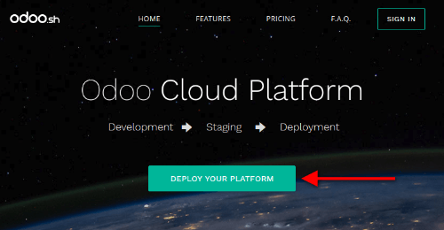

#### 2. Sign in with GitHub 🔗

Next, sign in with your `GitHub` account. If you don't have one, simply click on the **Create an account** link to get started.


#### 3. Authorize Odoo.sh ✅

You'll need to `authorize` Odoo.sh to access your GitHub account. 


This is crucial because Odoo.sh needs permissions to:
- `Know` your GitHub login and email.
- `Create` a new `repository` if you’re starting from scratch.
- `Read` your existing repositories if you’re using one.
- `Create` a `webhook` for updates when you push changes.
- `Commit` changes to streamline your deployment.

#### 4. Submit Your Project 📝

Decide whether to start from scratch or use an existing `repository`. Then, name your repository or select an existing one and choose the `Odoo version` you want to use. 

If you have a `subscription code`, enter it here. This code is tied to your `Enterprise subscription`, which includes `Odoo.sh`.

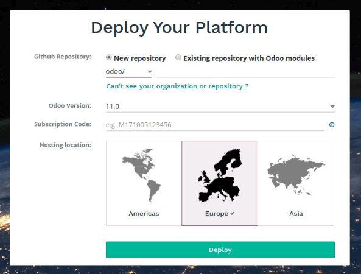


If your subscription isn't valid, it could mean:
- It doesn't exist.
- It’s not a partnership subscription.
- It’s an Enterprise subscription that doesn't include `Odoo.sh`.
- It’s another type of subscription (e.g., online subscription).

If you're unsure, contact `Odoo support` for assistance.

#### 5. You're Done! 🎉

Your platform is now being created. Soon, you'll be able to connect to your first `database`.

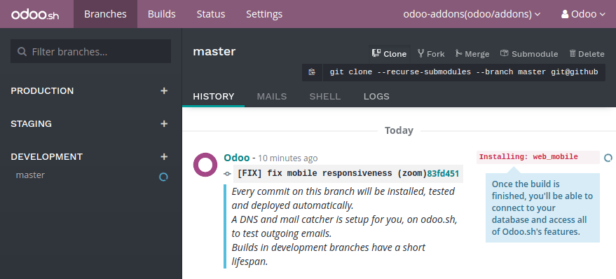


#### Importing Your Database 📥

You can import your database into your `Odoo.sh` project if it’s a supported version.

#### Pushing Your Modules to Production 🛠️

For `custom` or community `modules`, add them to a branch in your GitHub repository. `Odoo.sh` will detect the folders containing `Odoo addons`. 

You can structure your `modules` as you like, either at the root or in categorized folders.

For publicly available community modules, consider adding them as `submodules`. Make this branch your production branch or merge it into an existing one.

#### Downloading a Backup 💾

##### On-Premise Databases 🖥️

Access the URL `/web/database/manager` of your on-premise database and download a backup. 

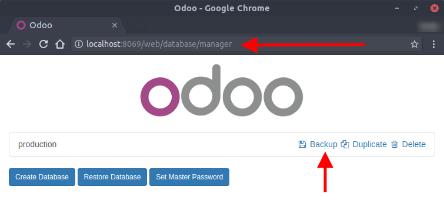


You'll need the `master password` of your database server. If you don't have it, contact your system administrator.

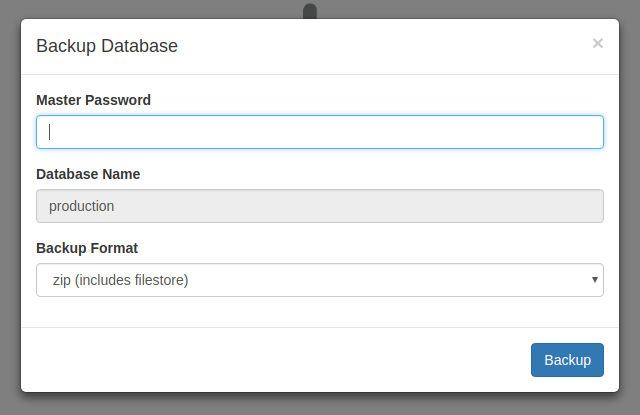


##### Odoo Online Databases 🌐

Access your database manager and download a backup. Note that online versions (e.g., saas-*) are not supported on `Odoo.sh`.


#### Uploading the Backup 📤

In your `Odoo.sh` project, go to the backups tab of your production branch and import the backup.


Once imported, you can access the database using the **Connect** button.

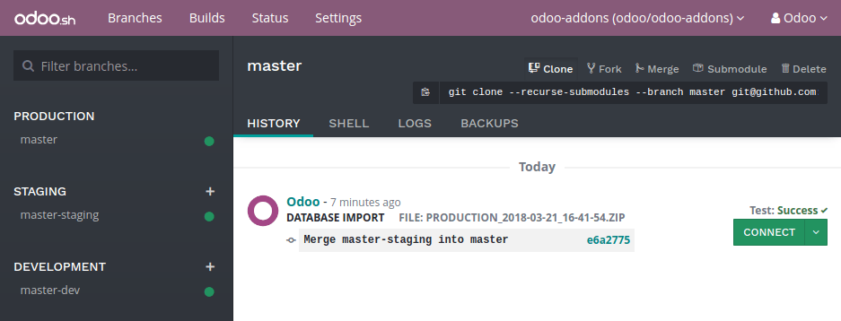


### Checking Outgoing Email Servers 📧

`Odoo.sh` provides a default mail server. Ensure no outgoing mail server is enabled in your database settings. 

After importing your database, all outgoing email servers are `disabled` by default.

### Checking Scheduled Actions ⏰

Scheduled actions are `disabled` after the import to prevent any unintended operations. 

If you plan to use the imported database in production, `enable` the necessary scheduled actions. 

These can be found under **Settings ‣ Technical ‣ Automation ‣ Scheduled Actions**.

### Registering Your Subscription 🔄

After importing, your subscription will be `unlinked`. 

Unlink your former database from the `subscription` and register the new one by following the database `registration` documentation.