# Learning Odoo 17.
A quick project to learn Odoo 17.

> **Note :**
> - I will rely on [the official documentation of Odoo 17](https://www.odoo.com/documentation/17.0/developer/tutorials/) for this mini-project and then summarize what I have learned.
>
> - I will use [ChatGPT](https://chat.openai.com/) to provide a summary with a simple storytelling technique, making this document accessible and easy to understand even for novices.

## Chap 1 : Architecture Overview

In the world of software, there exists a system known as Odoo, which follows a multitier structure. It resembles a grand castle with three distinct layers: the presentation tier, the logic tier, and the data tier. 🏰


In this castle, the presentation tier is like the castle's exterior, made of HTML5, JavaScript, and CSS. It's what visitors see and interact with. The logic tier, however, is like the castle's intricate machinery, all written in Python. This layer handles the castle's inner workings, ensuring everything runs smoothly. Lastly, the data tier, akin to the castle's vault, stores all the important information using PostgreSQL as its guardian. 🛡️

Now, within this castle, developers roam freely, crafting extensions called modules. Each module is like a special chamber dedicated to a specific purpose. Some modules add new features to the castle, while others extend existing functionalities. Imagine one module adding magical accounting rules to manage the kingdom's finances, while another conjures up real-time visualizations of flying dragons. 🐉

To understand these modules, one has to learn the castle's language. A module can contain various elements like business objects, object views, data files, web controllers, and even static web data like images and scripts. Each element serves a unique purpose, contributing to the castle's grandeur. 🌟

Imagine a brave adventurer embarking on a journey to create their own module. They venture into the module's directory, organized neatly like rooms in a castle. Inside, they find business objects, declared as Python classes, object views defining how information is displayed, and data files, either XML or CSV, holding vital information for the castle's operation. 🛠️

But wait, there are different versions of this castle! Odoo comes in two flavors: Enterprise and Community. The Enterprise version, with its licensed access, offers extra features, like secret chambers hidden within the castle walls. However, from a technical standpoint, these extra features are just additional modules layered atop the Community version. 🔒

Now, our adventurer is ready to embark on their journey. But before diving into writing code, they decide to prepare by reviewing the castle's installation process. After all, even seasoned knights need to ensure they start their quests on the right foot. 🚀

And thus, armed with knowledge and determination, our adventurer sets forth to conquer the realm of Odoo, one module at a time. 🌌

## Chapter 2: Development Environment Configuration


### Note:
> `./addons` : This directory contains all the modules we want to add to Odoo 17. Therefore, it includes the module we are going to develop.

> This directory will be part of the addon paths that reference all directories containing Odoo modules.
> 
> 
> `./config/odoo.conf` : This file contains Odoo configurations.
>
> `docker-compose.yml` : This file contains deployment configurations for deploying Odoo on localhost.

🌐 In the world of Odoo, where developers shape the digital corridors of the software, setting up the development environment is a key step. Like a chef preparing their favorite recipe, each developer has their own method, but for Odoo insiders, there's a preferred path: installation from the source code.

It all starts with environment preparation. Just like preparing ingredients to concoct a delightful dish, following the steps of the contribution guide is essential. Once these steps are followed, you have two precious ingredients: the local repositories [odoo/odoo](https://github.com/odoo/odoo) and [odoo/enterprise](https://github.com/odoo/enterprise).

For easier installation, it's better to use the [containerized version of Odoo](https://hub.docker.com/_/odoo/) and then orchestrate with Docker. Take a look at the `./docker-compose.yml` file.

To complete the preparation, you need to copy this project to your personal GitHub account. Click `"Fork"` to create a copy of this repository in your account.

Then, using the command below, replace `<your_github_account>` with the name of your GitHub account to download your copy of this project to your machine:

```bash
git clone git@github.com:<votre_compte_github>/learning-odoo-17.git
```

And there you go! Your environment is ready to run Odoo on your local machine. And here's how to launch Odoo 17 on your machine:

```bash
cd learning-odoo-17
docker compose up -d
```
To check the installation, simply open your browser and type [http://localhost:8069/web](http://localhost:8069/web).

```yaml
username : admin
password : admin
```


To view the `logs` data of the `odoo` container:

```bash
docker logs -f odoo17Learning
docker logs -f postgres_odoo17Learning
```


To view the `logs` data the `postgres` container:

```bash
docker logs -f postgres_odoo17Learning
```


Now that your server is running, it's time to write our own application! 😎

## Chapter 3 : A New Application.

📖 The purpose of this chapter is to embark on a journey of creation, laying the very foundation for a brand new `Odoo module`. Imagine starting from scratch, with only the bare essentials needed to catch Odoo's attention. As we progress through the chapters, we'll add layers of features, weaving a tapestry of a realistic business case.

🏠 Welcome to the realm of the `Real Estate` Advertisement module. This module delves into a specialized business area not commonly found in the standard set of Odoo modules: `real estate`. But before diving headfirst into development, it's wise to scout Odoo's vast kingdom to ensure no existing solutions already address our specific needs.

🔍 Picture a main `list view` adorned with various advertisements, each telling a story of properties waiting to be discovered. The form view reveals essential details about each property: from the number of bedrooms to the presence of a garden, offering a glimpse into the world within.


💼 The second tab unveils a treasure trove of `offers`, where potential `buyers` can make `bids` above or below the expected `selling price`. It's a realm where `negotiations` unfold, leaving the final decision in the hands of the `seller`.

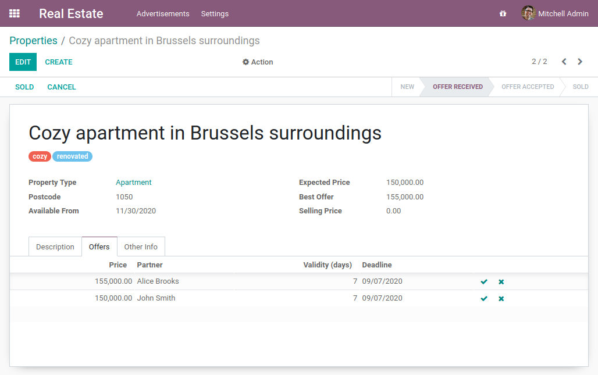

🎥 And as if by magic, a quick video showcases the graceful dance of the module's workflow. Ah, if only it were captured already!

🛠 But fret not, for our journey begins with a humble task: preparing the `addon directory`. This step ensures that Odoo recognizes our newborn module, even if it's but an empty vessel for now. Soon, it will proudly stand among the `Apps`, awaiting its chance to shine.

✨ With a flick of a wand (or perhaps a few keyboard strokes), we create the necessary files: `__init__.py` and `__manifest__.py`. These files breathe life into our module, defining its `name` and `dependencies`, much like a spellbook detailing the ingredients of a potent potion.

🧙‍♂️ `Restart` the Odoo server, `update` the Apps list, and behold! Our module, like a budding flower, blooms into view. But wait, did it not appear? Fear not, for a simple tweak, removing the `default filter`, reveals our creation in all its glory.

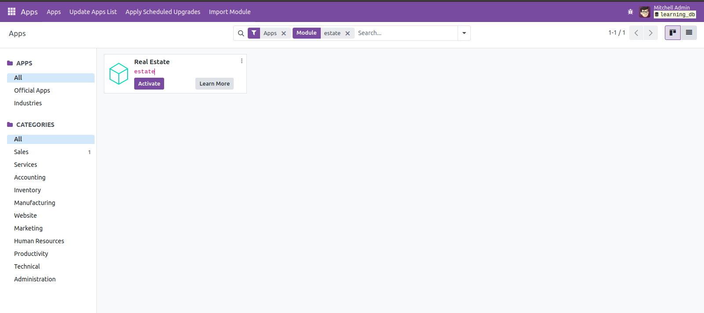

🔑 And now, with a final flourish, `we make our module an 'App'`, ensuring its presence even when the `Apps filter` is on. Though it may be but an empty shell, devoid of menus, it's a promising start to our magical journey.

📜 With the groundwork laid, our adventure continues as we prepare to `create our first model`. Exciting times lie ahead as we breathe life into our module, one enchanting step at a time.

## Chapter 4 : Models And Basic Fields

🏰 Picture our `Odoo module` as a freshly built house - sturdy and promising, yet lacking the warmth of life within its walls. In this chapter, our quest was to breathe life into our module by giving it the ability to `store data`. 💼

As we delved deeper into the documentation, we discovered [Object-Relational Mapping (ORM)](https://www.prisma.io/dataguide/types/relational/what-is-an-orm), a wondrous tool bridging the gap between our Python code and the `database`. ✨ This powerful technique allows us to define our `business objects as Python classes`, extending the `Model` class. With a simple invocation, our model came to life, seamlessly integrating into Odoo's automated persistence system.

Our task was to create the `real estate properties model`. Inspired by the example given in the `CRM module`, we embarked on our quest, shaping the necessary files and folders to define our `model`. 🏡 With each keystroke, the framework began to take shape, and soon, our model stood proudly, ready to capture the essence of `real estate properties`.

But our journey did not end there. We set out to infuse our model with `basic fields`, such as `name`, `description`, and `price`. Like an artisan adding details to a work of art, we enriched our model with `fields` of different `types` - `Char`, `Text`, `Integer`, and even `Boolean`. Each field brought a new dimension to our `model`, enriching it with the essence of real-world data. 🎨

💡 Here's how to connect to the database inside the container to view the data.

```bash
docker exec -it postgres_odoo17Learning psql -U admin -d learning_db

SELECT COUNT(*) FROM estate_property;

\d estate_property;
```


Yet, our work was not complete until we ensured the `integrity` of our `data`. With a flourish of our craftsmanship, we defined `attributes` for our `fields`, making them `required` and ensuring their presence in every `record`. We even explored the realm of `Automatic Fields`, uncovering the hidden mechanism behind fields like `id`, `create_date`, and `write_user`. 🔮

And so, our journey through Chapter 4 came to an end, but our module was now imbued with the power to `store and manage` real estate `data`. With each step forward, our `module` grew stronger, paving the way for greater adventures in the realm of `Odoo`. 🚀

## Chapter 5: Security - A Brief Introduction

In the journey of building our `Odoo module`, we've ventured into the realm of `security`, a crucial aspect in any software application, especially when it comes to managing `sensitive` business `data`. 🏰

Imagine our `module` as a fortified castle, safeguarding valuable `information` about properties and transactions within its walls. But who gets `access` to enter this castle? This is where `Odoo's security mechanism` comes into play, like the gatekeeper controlling entry to the castle. 🛡️

We've learned that `Odoo` relies heavily on data, and one way to populate our `module` with essential information is through `CSV files`. These files act as the blueprint, defining the structure and content of our data. For instance, we've seen how a `CSV file` sets up the states of countries, laying the foundation for our data castle. 📋

However, `loading data` is just one part of the `security` equation. We also need to `control` who can `view`, `edit`, `create`, or `delete` this data. This is where `access rights` come in. Access rights act as the guards patrolling the castle walls, ensuring only `authorized users` can access specific areas. 🚨

To implement `access rights`, we create `rules` that dictate what each `user` or `group` of users can do within our `module`. These `rules` are defined in `CSV files`, just like our data files, and are loaded into Odoo's security system.

In our journey, we've set out to `grant access rights` to the `base.group_user`, essentially allowing them to roam freely within our module, albeit within certain limits. 🔒


With `access rights` in place, our module's `security` is fortified, and we're now ready to open the gates and let users interact with our `module's user interface`, marking the next phase of our adventure in Odoo development. 🚀

## Chapter 6: Finally, Some UI To Play With

Now that we've laid the foundation with our new `model` and access rights, it's time to dive into the exciting world of `user interface` interaction. 🚀

### Data Files (XML)

In our journey to understand `Odoo`, we've encountered various ways to handle `data`. While `CSV files` are great for simple data, the `XML format` steps in for more `complex structures` like `views` or email templates. These `XML files`, residing in the same folders as `CSVs`, define the intricate `UI elements` we interact with. 📝

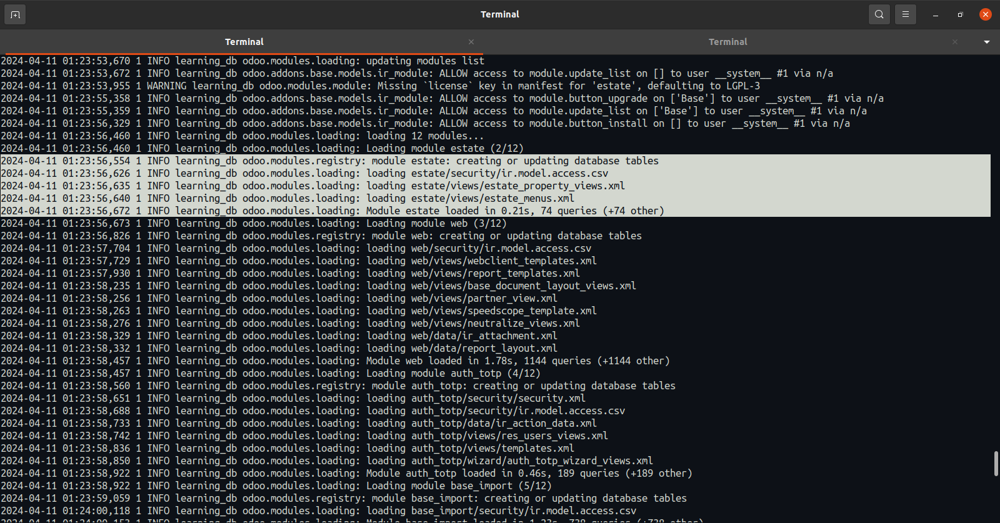

### Actions and Menus

`Actions` are the `bridge` between `menus` and `models`, defining what happens when we `click` or interact with `elements` in the interface. In our `real estate` scenario, actions empower us to navigate through lists and `forms` seamlessly. ⚙️


`Menus` in Odoo follow a `hierarchical structure`, guiding us through different `levels` of the `interface`. By defining `menus` in `XML files`, we craft an intuitive `navigation` experience for users, leading them to the heart of our application. 📂

### Fields, Attributes, and Views

Fine-tuning the `view` is crucial for a `user-friendly` experience. We can set `default values` for fields, specify `read-only` fields, and control field behavior during `duplication`. In our `real estate` adventure, we ensure that our data behaves as expected, setting defaults and enforcing `rules` for smoother operations. 🎨

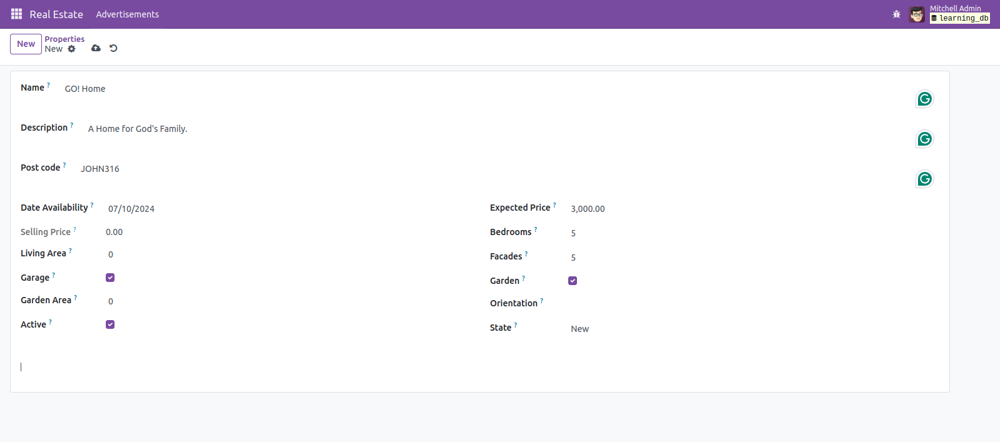

### Reserved Fields and States

Certain `fields` in Odoo come with `predefined behaviors`, guiding how data behaves within the system. By understanding and leveraging these `reserved fields`, we can fine-tune our application to suit our needs effectively. 🛠️

With each step, we're unlocking new possibilities in our journey with `Odoo`. As we delve deeper into defining our `views`, the interface becomes not just a canvas but a portal to a seamless `user experience`. 🌟

## Chapter 7: Basic Views

🌟 In our journey through Odoo's realm, we've ventured into crafting `models` and setting up `access rights`. Now, it's time to give our application a face, a `user interface` where users can interact and bring our creation to life.

`Views`, the windows to our application's soul, are where the magic happens. They `organize and present data` in a way that's not only meaningful but also intuitive for users to `navigate`.

Imagine you're building a `real estate` app. You wouldn't want just a `list` of properties or a cluttered `form`. You'd want an `organized layout` where users can easily find what they need. That's where `views` come in.

### List Views: 📋


Think of `list views` as the bird's-eye view of your data. They're like `spreadsheets`, neatly arranging `records` for easy scanning. In our `real estate app`, we want more than just property names on this list. We want to see `essential details` like the last seen date too.

### Form Views: 📝

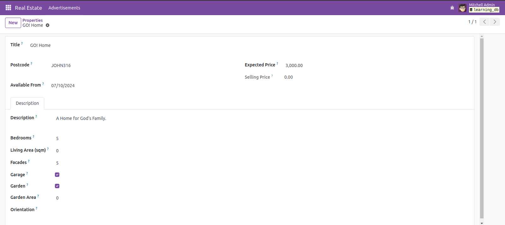

Now, imagine you're `editing` a property's `details`. You wouldn't want a chaotic mess of fields. `Form views` provide structure. They `group fields` logically, making it easy to `input` or `edit` property `information`. It's like filling out a `form` where everything has its place.

### Search Views: 🔍

`Searching` for a property? `Search views` help narrow down your options. They `filter` out unwanted clutter, leaving you with exactly `what you need`. In our app, we want to `filter` properties by `availability` and `group` them by `postcode` for convenience.


As we sculpt these `views`, remember, it's not just about aesthetics. It's about `creating an experience` that users will `love`. So, let's dive in and `design views` that breathe life into our real estate world.

### Note:

We're just scratching the surface here. There's still much to explore, like `custom filters` and `grouping`. But for now, let's revel in the joy of creating `views` that make our `app shine`.

## Chapter 8: Relations Between Models

In our quest to build the ultimate `real estate management system`, we've journeyed through the intricacies of crafting `models` and designing intuitive `views`. Now, armed with a deeper understanding of how `views` shape user `interaction`, we venture into the realm of `model relationships`.

Imagine our `real estate application` as a bustling marketplace, where properties, customers, and agents converge in a complex web of `connections`. Just as our `views` provide windows into our `data`, these `relationships` offer pathways for seamless `interactions` between different `entities`.

### Many2one: 🌐

In our bustling real estate marketplace, `properties` often have distinct `types`, `buyers`, and `sellers`. With `Many2one` fields, we establish clear links between these entities, enabling us to easily associate each property with its type, buyer, and seller. 


It's like building bridges that `connect` different parts of our marketplace, ensuring smooth navigation for users.


### Many2many: 🔗

But our marketplace isn't just about individual properties; it's about the stories they tell. With `Many2many relationships`, we enrich these stories by tagging properties with descriptive labels like 'cozy' or 'renovated.' 


It's like adding layers of depth to our marketplace, allowing users to explore properties based on unique characteristics.

### One2many: 🔄

And what's a marketplace without `offers`? With `One2many relationships`, we capture the dynamic exchange of offers between buyers and sellers. Each property can now boast a gallery of offers, each representing a potential transaction waiting to unfold. 

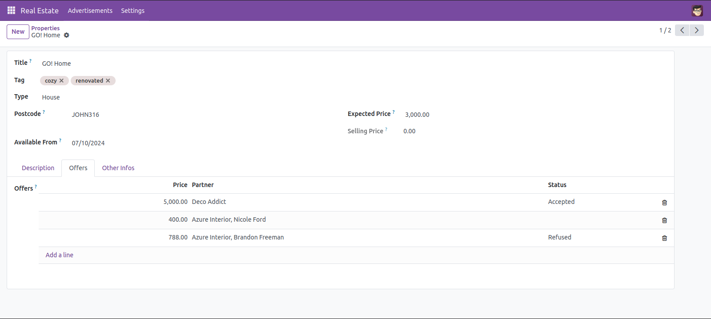

It's like opening a window into the negotiation process, where every offer adds to the intrigue of our marketplace.

As we weave these `relationships` into the fabric of our `real estate module`, we create a dynamic ecosystem where data flows seamlessly between entities. It's not just about organizing information; it's about fostering meaningful connections that bring our marketplace to life.

And so, armed with the knowledge of `model relationships`, we embark on the next phase of our journey, eager to explore the boundless possibilities that await us in the realm of `Odoo`.

*Notes:*
> Because a `One2many` is a `virtual` relationship, there must be a `Many2one` field defined in the `comodel`.


## Chapter 9: Computed Fields And Onchanges

In our journey to master the intricacies of Odoo 17, we find ourselves standing at the threshold of a new frontier: `computed fields` and `onchange` mechanisms. These may sound daunting, but fear not, for they hold the key to unlocking the true potential of our `real estate` management system.

### Unveiling Computed Fields: 🧮

Imagine our `real estate` system as a grand canvas, waiting to be painted with `data`. `Computed fields` are our brushes, allowing us to `dynamically` calculate values based on other `fields`. It's like magic; we define the rules, and Odoo does the rest.

For instance, let's say we want to `calculate` the `total area` of a property by summing up its `living area` and `garden area`. With `computed fields`, this becomes a breeze. We simply define the formula, and Odoo handles the calculations behind the scenes.

### Embracing Dependencies: 🔗

But here's the catch: `computed fields` often rely on the values of other fields. Think of them as puzzle pieces that fit together to form a complete picture. We use the `@api.depends` decorator to specify these `dependencies`, ensuring that our computations stay in `sync` with the underlying `data`.


For example, if the living area or garden area of a property `changes`, we want the total area to `update automatically`. By defining these `dependencies`, Odoo knows exactly when to recalculate the total area, keeping our `data` accurate and `up-to-date`.

### Mastering Onchange Magic: 🎩

Now, let's shift our focus to `onchange` mechanisms, the wizards of `data manipulation`. Imagine our `real estate` system as a living, breathing entity that `responds` to user inputs in `real-time`. `Onchange methods` allow us to perform actions on the fly, without ever saving anything to the database.

Suppose we want to enhance the user experience by `automatically` setting the garden area to 10 and the orientation to North when the 'garden' field is toggled on. `Onchange methods` make this possible, creating a seamless and intuitive interface for our users.


### Striking a Balance: ⚖️

As we delve deeper into the realm of `computed fields` and `onchanges`, it's crucial to strike a balance. While these tools empower us to `automate tasks` and streamline workflows, we must exercise caution not to overcomplicate things.

Remember, `simplicity` is key. Avoid the temptation to add unnecessary complexity, and always prioritize `clarity` and ease of use. After all, our goal is to build a `real estate` management system that empowers users of all levels, from novice to expert.

### Looking Ahead: 🔍

Armed with the knowledge of `computed fields` and `onchanges`, we stand poised to embark on the next leg of our journey. In the upcoming chapter, we'll explore how to trigger business logic with the click of a `button`, unlocking even greater possibilities for our `real estate` management system.

So, dear traveler, let us march forward with confidence, for the path ahead is paved with boundless opportunities to shape the future of `real estate` management with Odoo 17.

## Chapter 10: Ready For Some Action?

As we continue our odyssey through the realms of Odoo 17, we find ourselves at a pivotal juncture, where the concepts of `computed fields` and `onchange` mechanisms have laid the foundation for even greater feats within our `real estate` management system.

### Harnessing the Power of Action: 🚀

Picture our `real estate` system as a bustling marketplace, alive with possibilities. Now, imagine imbuing it with the ability to take `action—canceling` properties, marking them as `sold`, accepting or refusing offers—all with the click of a button. This is the realm of `action buttons`, where digital switches trigger tasks that shape the destiny of our system.

### Seamlessly Integrated Functionality: 🔧

But how do we make this magic happen? It's simple yet profound. We embed `buttons` in our interface, each tied to a specific action. 


When users click these `buttons`, they set off a chain reaction of events, seamlessly integrating functionality into our system's fabric.

### A Symphony of Logic and User Experience: 🎶

These `action buttons` serve as conduits for our system's logic, orchestrating a symphony of user experience and functionality. 

Want to `cancel` a property? Just hit `"Cancel."` Sold it? Press `"Sold."` The process is intuitive, guided by the logic we've meticulously woven into our system.


But that's not all. We want our system to handle offers with grace and efficiency. By adding buttons like `"Accept"` and `"Refuse"` to our offer listings, we can streamline the process even further. And when an offer is `accepted`, the magic happens: the buyer is assigned, the selling price is set, all seamlessly orchestrated by the click of a button.

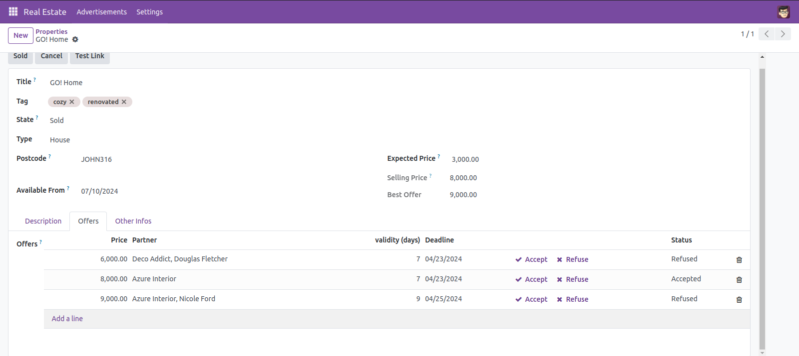

Now, you might wonder, how do we bring this magic to life? It's simpler than you think. We embed these `buttons` into our interface and `link` them `to` Python `methods` that perform the `desired actions`. By marking these `methods as public` and assigning them to the `buttons`, we unleash their power upon our system.

### Guiding Principles: 🌟

Yet, as we venture deeper into the realm of `action buttons`, let us heed a few guiding principles. `Simplicity` reigns supreme; let's resist the allure of unnecessary complexity. `Clarity` and `ease of use` should guide our every decision, ensuring that our system empowers users of all levels.

### A Glimpse of Tomorrow: 🔮

With `action buttons` at our disposal, we stand on the cusp of a new dawn. In the chapters to come, we'll explore how to `prevent incorrect data` from infiltrating our system, fortifying its foundations and ensuring its resilience in the face of real-world challenges.

So, fellow voyager, let us embark on this journey with heads held high, for the path ahead brims with promise and the potential to reshape the landscape of `real estate` management with Odoo 17.

**Notes:**

> In **Chapter 6: Finally, Some UI To Play With**, we created an action that was linked to a menu. You may be wondering if it `is possible to link an action to a button`. Good news, it is! One way to do it is:
> ```xml
> <button type="action" name="your_module.action_name" string="Button Label"/>
> ```

## Chapter 11: Constraints

With the dawn of Chapter 10, we embraced the power of `action buttons`, transforming our real estate management system into a dynamic marketplace of possibilities. Yet, as our journey unfolded, we encountered a new challenge: ensuring the integrity of our data amidst the ever-changing currents of user input.

### Safeguarding the Realm: ⚔️

In our quest for data integrity, we discovered the formidable tools of `constraints`. These guardians of `truth` stood as sentinels, warding off the specter of incorrect `data` with unwavering resolve.

### The Arsenal of Constraints: 🛡️

With Chapter 11, we delved deeper into the arsenal of constraints, uncovering two mighty weapons: `SQL constraints` and `Python constraints`. Like knights donning armor, SQL constraints fortified our database with impenetrable barriers, ensuring that amounts remained positive and names stood as unique beacons of identity.

### The Wisdom of Odoo: 📜

Yet, in the labyrinth of data management, `SQL` alone could not suffice. With `Python` constraints, we wielded the wisdom of Odoo to craft intricate spells of logic, guarding against the subtle nuances of incorrect data with precision and finesse.

### An Exercise in Mastery: 🏋️‍♂️

Guided by the hand of Odoo, we embarked on exercises that tested our skills and honed our craft. From ensuring positive prices to safeguarding the uniqueness of property tags, each challenge brought us closer to mastery over our realm of data.


In our quest to perfect our real estate module, we encountered an exercise of great importance: to ensure that **no offer could be accepted if it dared to fall below 90%** of the expected price. With the guidance of Odoo, we crafted a `Python constraint`, leveraging the power of float comparison to safeguard our realm against unwelcome intruders.


### A Cautionary Tale: ⚠️

But amidst our triumphs, a cautionary tale echoed through the halls of our adventure. Odoo warned us to tread carefully when working with floats, urging us to wield the tools of float comparison and precision handling with care and reverence.

### A Journey Unfolds: 🌟

As our tale draws to a close, we stand on the threshold of a new chapter, where the user interface awaits our touch of refinement. With each constraint we add, with every line of code we write, our real estate management system evolves, poised to shape the future of property management with Odoo 17.

Chapter 12: Add The Sprinkles

With the formidable arsenal of constraints now firmly in place, our real estate management system stands as a fortress of data integrity, safeguarded against the specter of erroneous input. Yet, as our journey through Odoo 17 continues, we find ourselves at a pivotal juncture: the refinement of our user interface.

In Chapter 11, we fortified our realm with the formidable tools of SQL and Python constraints, ensuring that our data remained pristine amidst the tumultuous currents of user interaction. Now, as we gaze upon the landscape of our real estate module, we recognize the need to add a touch of visual flair and intuitive functionality to enhance the user experience.

As we embark upon Chapter 12, our mission is clear: to add the final touches that will elevate our real estate management system from a mere tool to a delightful and intuitive platform for property management.

## Chapter 12: Add The Sprinkles

### Adding Visual Flair:
- We aspire to infuse our `list views` with vibrant `colors`, distinguishing properties with offers received, offers accepted, and those that have been sold or canceled.

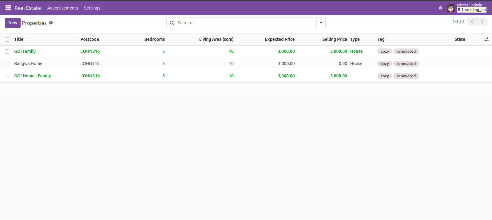

- Through the judicious use of color `decorations`, we aim to create a visual language that intuitively conveys the status of each property at a glance.

### Streamlining User Interactions:
- We seek to streamline user `interactions` by dynamically adjusting the `visibility` of buttons and fields based on contextual conditions.


- By employing conditional `visibility attributes`, we can ensure that users are presented with only the most relevant `options` at any given moment, enhancing usability and reducing cognitive load.

### Empowering Efficient Searching:
- We endeavor to empower users with `efficient search` capabilities, enabling them to quickly `filter` properties with `values` based on `specific criteria` such as living area.


- Through the addition of default filters and custom search domains, we aim to streamline the search process, facilitating faster access to relevant property listings.


### Elevating Data Presentation:
- We aspire to elevate the presentation of data within our `forms` and lists, leveraging `inline views` to provide contextual insights and enabling users to interact with related `records` seamlessly.

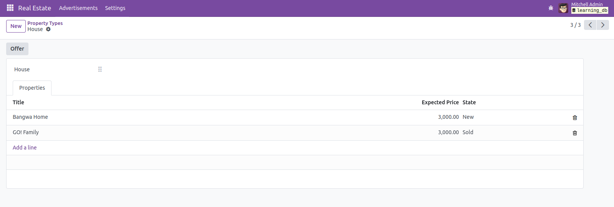


- By harnessing the power of `widgets`, we can tailor the display of fields to suit the unique requirements of our real estate module, enhancing `clarity` and usability.

### Unveiling Insights with Stat Buttons:
- We recognize the value of providing users with quick access to insightful data, and thus, we seek to implement `stat buttons` that offer a glimpse into key metrics such as the number of offers associated with a specific property type.

- Through the judicious use of `related fields` and custom actions, we aim to unveil actionable insights with a single click, empowering users to make informed decisions.

As we embark upon this journey to add the final sprinkles to our `real estate module`, we do so with a sense of purpose and determination. With each enhancement we introduce, we draw closer to our vision of creating a user experience that is both delightful and `intuitive`, setting the stage for a new era in property management with Odoo 17.

## Chapter 13: Inheritance 🏰

After adding the final 🎨 decorative touches to our 🏠 `real estate module` in the previous chapter, we now dive into Chapter 13 to explore even more features that enhance the user experience.

### Inheriting for Innovation:
Like meticulous craftsmen, we seek to refine existing functionalities by exploring 🔗 `inheritance` mechanisms in Odoo. This allows us to ➕ `add new features` while preserving code integrity and system stability.

### Python Inheritance:
Similar to superheroes acquiring new powers, we learn to 🚀 `extend standard methods` of data creation, reading, writing, and deletion.

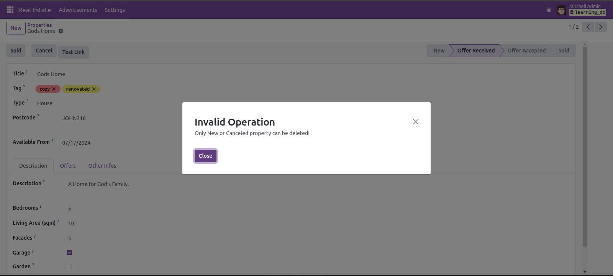

For example, we now 🚫 prevent the `accidental deletion` of important properties by disallowing the deletion of any property that is not new or canceled.

### Model Inheritance:
Like an artist 🎨 painting a canvas, we ➕ `add new fields` to our existing models to enrich the functionality of our system.

### View Inheritance:
As user experience architects, we 🛠️ `customize` the appearance of our `user interface` by inheriting existing `views` and adapting them to our specific needs.

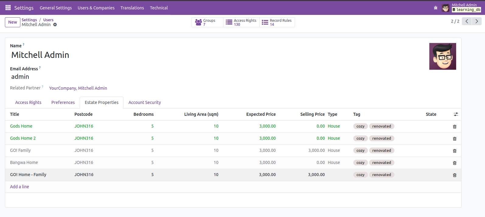

For example, we ➕ `add a new tab` in the user view to display a list of `available properties`, providing users with quick and intuitive access to relevant information.

😃 With each new improvement we make, we move closer to our goal of creating an exceptional and intuitive user experience.

By `fine-tuning` details, `adding` new features, and `refining` the user interface, we shape Odoo to perfectly meet the needs of our business, paving the way for even more efficient and effective `real estate` management with Odoo 17. 🌟

## Chapter 14: Interact With Other Modules 🤝

Building upon the foundation laid in Chapter 13, where we delved into the art of inheritance to enhance our `real estate module`, we now embark on a new journey of `integration` and collaboration.

### Bridging the Gap with Invoicing

As we continue to polish our `real estate` solution, we recognize the need to seamlessly `connect` with other `modules`, unlocking new functionalities and streamlining workflows. In this chapter, our focus shifts towards `integrating` with the `Invoicing module` to automate the `invoice generation` process. 📑💼

### Introducing the Link Module

Just as skilled artisans carefully craft intricate designs, we meticulously design a `'link' module` to bridge our `real estate` and `accounting` functionalities. 

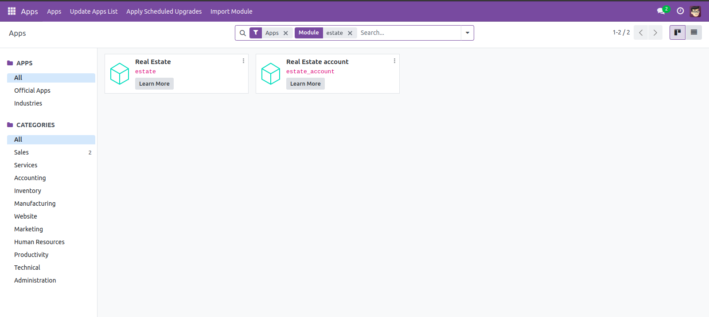

By depending on both the `estate` and `account` modules, this `link module` serves as a conduit for data exchange, ensuring interoperability while maintaining `modularity`. 🌐🔗

### Model Inheritance: Extending Capabilities

In the spirit of innovation, we extend our `real estate` module's capabilities through `model inheritance`. 

By `overriding` the `action triggered` when a property is `sold`, we lay the groundwork for `automated invoice` creation, seamlessly integrating with the Invoicing module. 🚀🏠

### Crafting Invoices with Precision

With the framework in place, we turn our attention to crafting `invoices` with precision. 

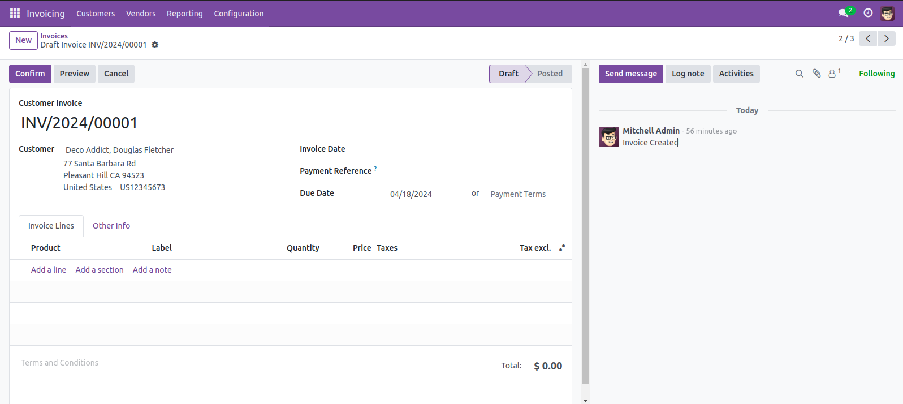

Each `invoice` is meticulously populated with essential details such as customer ID and move type, setting the stage for accurate financial transactions. 🧾💳

### Adding Finishing Touches: Invoice Lines

Just as a skilled artist adds brushstrokes to complete a masterpiece, we add `invoice lines` to our invoices. 


Each line meticulously `captures transaction` specifics, ensuring clarity and accuracy in financial records. 🎨✨


### A Seamless Integration Journey

With each step, our `real estate` solution evolves into a comprehensive and integrated platform. By seamlessly connecting with the `Invoicing module`, we empower users with automated workflows and enhanced efficiency.

As we navigate through this integration journey, we draw closer to our vision of creating a seamless and intuitive real estate management solution with Odoo 17. 🏡🔧